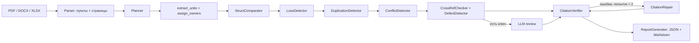

# 🧭 OrgTrace — ИИ-агент анализа организационной структуры и функционала

> HackAlem AI · Кейс 1. Агент, который не верит на слово: каждый вывод подтверждён цитатой
> из исходного документа, а цитаты сверяются кодом, а не моделью.

## 1. Название проекта

**OrgTrace** — прослеживаемое сравнение организационных документов «до» и «после» реорганизации.

## 2. Краткое описание

При реорганизации эксперту приходится вручную сопоставлять положения и приложения, чтобы найти
потерянные, дублирующиеся функции и конфликты интересов. OrgTrace сравнивает две редакции
документа и формирует аналитическое заключение, в котором у каждого вывода указаны документ,
пункт, страница и дословная цитата.

**Пользователь:** сотрудник подразделения, который анализирует организационные изменения.

## 3. Что реализовано

- Разбор PDF, DOCX и XLSX на пункты с номером страницы. Учтены склеенные пункты
  («…Общества. 3.10.Работники…»), подпункты «а., б.», номера страниц и оглавление.
- Извлечение оргструктуры из пункта «…состоит из следующих структурных подразделений», должностей
  и подчинённости. Закрепление функций раздела 5 за подразделениями по заголовкам вида
  «5.4. Директор департамента …:».
- **Must have 1.** Определение созданных, сохранённых, реорганизованных и упразднённых
  подразделений (`StructComparator`).
- **Must have 2.** Выявление потерь, частичных потерь (с указанием утраченного фрагмента текста),
  переносов функций и устранённого дублирования (`LossDetector`).
- **Must have 3.** Дублирование функций (`DuplicationDetector`, типовые обязанности руководителей
  отфильтрованы) и конфликты интересов (`ConflictDetector`: перекрёстное подчинение,
  самопроверка «консультирование + мониторинг», управленческие роли в подконтрольных обществах).
- **Must have 4.** Прослеживаемость: у каждого вывода есть `doc_id`, пункт, страница и цитата.
  `CitationVerifier` программно сверяет их с текстом пункта, `CitationRepair` исправляет
  неточности (до 2 попыток). Неподтверждённые выводы выносятся в отдельный раздел отчёта.
- **Must have 5.** Аналитическое заключение в Markdown и JSON, интерфейс Streamlit с вкладками.
- Дополнительно: битые перекрёстные ссылки после перенумерации, пустые пункты, упоминания
  должностей, которых нет в структуре.
- Необязательный LLM-слой (при наличии `OPENAI_API_KEY`): LLM-судья для пограничных случаев
  потери и дублирования, резюме для эксперта, чат с агентом через Function Calling
  (инструменты `search_clauses`, `get_clause`, `list_findings`).

## 4. Как работает решение

1. Пользователь загружает документ «ДО» и документ «ПОСЛЕ» (или нажимает «Демо»).
2. Агент на LangGraph проходит шаги:
   `parse → plan → structure → struct_compare → loss → duplication → conflict → crossref →
   [llm_review] → verify ⇄ repair → report`.
   Планировщик решает, какие инструменты применимы к загруженным документам, а верификатор
   возвращает неподтверждённые выводы на исправление.
3. Интерфейс показывает ход агента, метрики, выводы по вкладкам с цитатами «было / стало»
   и отчёт для скачивания в Markdown и JSON.

## 5. Технологии

Python 3.11, FastAPI, Streamlit, LangGraph, Pydantic v2, PyMuPDF, python-docx, openpyxl,
scikit-learn (TF-IDF), rapidfuzz, numpy, pytest. Необязательно: OpenAI API (`gpt-4o`,
`text-embedding-3-small`) — модели задаются через переменные окружения.

## 6. Архитектура



| Компонент | Файл |
|---|---|
| Парсер | `app/parser/clauses.py`, `app/parser/loader.py` |
| Оргструктура и владельцы функций | `app/agent/structure.py` |
| Инструменты-детекторы | `app/agent/detectors.py` |
| Сходство (TF-IDF / OpenAI) | `app/agent/similarity.py` |
| Верификатор цитат | `app/agent/verifier.py` |
| Граф агента (LangGraph) | `app/agent/graph.py` |
| LLM и Function Calling | `app/agent/llm.py` |
| Отчёт | `app/report.py` |
| API | `app/main.py`, `app/pipeline.py` |
| Интерфейс | `ui/app.py` |
| CLI | `app/cli.py` |
| Тесты | `tests/` |

### Соответствие требованиям кейса

| Требование | Где реализовано | Пример вывода на контрольном комплекте |
|---|---|---|
| 1. Реорганизованные / сохранённые / созданные | `Toolkit.struct_comparator` | Направление ВА → ДИТААД + ДОА; ДНМ и ДККМ сохранены |
| 2. Потеря функций | `Toolkit.loss_detector` | ред. 8 п. 5.6.2 «формировать группы контроля качества» — нет в ред. 9 |
| 3. Дублирование и конфликт интересов | `duplication_detector`, `conflict_detector` | ред. 9 п. 5.3.8 (ДИТААД/ДОА) и п. 5.4.5 (ДНМ) |
| 4. Источник для каждого вывода | `app/agent/verifier.py` | 0 неподтверждённых выводов |
| 5. Итоговое заключение | `app/report.py`, `ui/app.py` | `demo_cache/report_08_09.md` |

## 7. Установка и запуск

```bash
git clone <URL_РЕПОЗИТОРИЯ> && cd orgtrace
python -m venv .venv && source .venv/bin/activate      # Windows: .venv\Scripts\activate
pip install -r requirements.txt
cp .env.example .env            # ключ OpenAI необязателен
streamlit run ui/app.py         # интерфейс: http://localhost:8501
uvicorn app.main:app --port 8000   # API и Swagger: http://localhost:8000/docs
```

Через Docker: `docker compose up --build`. Команды `make test`, `make ui`, `make api`,
`make demo` делают то же самое короче.

## 8. Как проверить решение

```bash
pytest -q          # 14 тестов: парсер, золотой набор ред. 8 → 9, верификатор цитат
python -m app.cli data/samples/polozhenie_red08_protocol13.pdf \
                  data/samples/polozhenie_red09_protocol7.pdf --out report
```

В интерфейсе нажмите «Демо: Положение о ВА, ред. 8 → ред. 9». Ожидаемый результат
в детерминированном режиме (без ключа):

| Показатель | Значение |
|---|---|
| Подразделения: создано / сохранено / реорганизовано | 2 / 2 / 1 |
| Функции: потеряно / частично / перенесено | 3 / 4 / 2 |
| Дублирование / конфликты интересов / дефекты документа | 2 / 3 / 4 |
| Неподтверждённых выводов | 0 |

Эталонный отчёт: `demo_cache/report_08_09.md` и `demo_cache/report_08_09.json`.

API: `POST /api/analyze` (multipart-поля `before`, `after`), `POST /api/analyze/demo`,
`GET /api/report/{run_id}.md`, `POST /api/chat` (нужен ключ), `GET /health`.

## 9. Данные и интеграции

- Контрольный комплект организатора: `data/samples/` (Положение о внутреннем аудите,
  ред. 8 — протокол № 13; ред. 9 — протокол № 7).
- OpenAI API — только при заданном `OPENAI_API_KEY`. Без ключа внешних обращений нет.
- Результаты запусков сохраняются в `runs/`, эмбеддинги OpenAI кэшируются в `.cache/`.

## 10. Ограничения

- Выводы рекомендательные и требуют проверки ответственным сотрудником.
- Сравнивается один основной документ «до» и один «после».
- Структура извлекается из текстовых положений; схемы-картинки не распознаются (OCR нет).
- В DOCX нет страниц: вместо номера страницы используется условный блок из 40 абзацев.
- Пороги сходства откалиброваны на контрольном комплекте; на других документах
  их нужно проверить.
- Сопоставление с законодательством и бенчмаркинг с другими операторами не реализованы.
- В LLM-режиме модель может переклассифицировать пограничные случаи; золотые тесты
  фиксируют детерминированный режим. LLM-путь проверен на имитации клиента OpenAI.
- Чат с агентом недоступен для кэшированного результата демо.

## 11. Deployed-версия

`<DEPLOY_URL>` — Render (`render.yaml`: сервисы `orgtrace-ui` и `orgtrace-api`).
