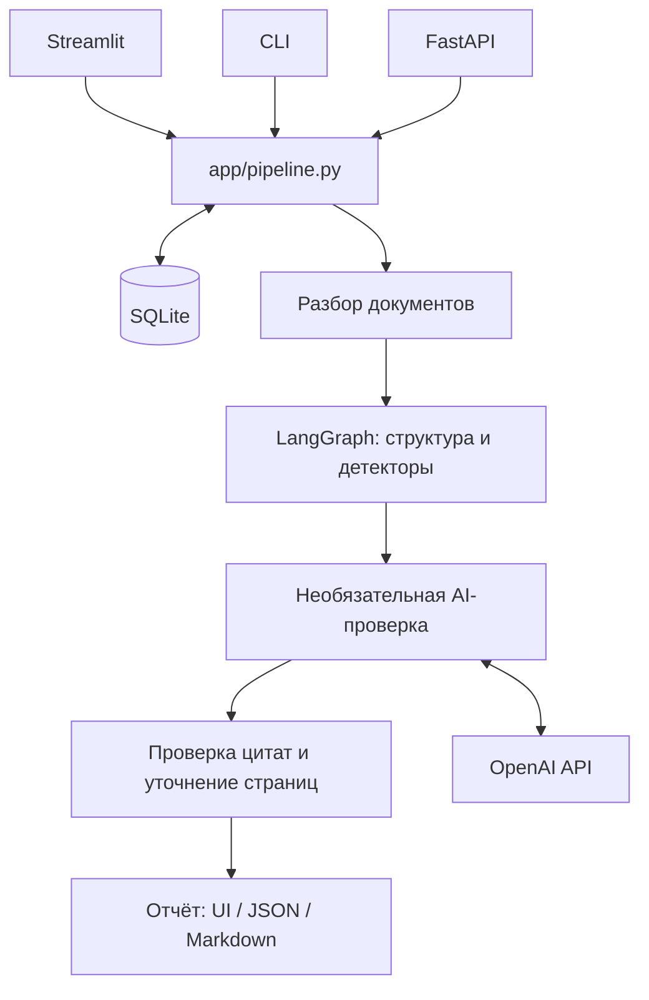

# OrgTrace — анализ организационной структуры и функций

**Демо для жюри: [orgtrace-production.up.railway.app](https://orgtrace-production.up.railway.app)**

Откройте сайт и нажмите **«Открыть демо»** — регистрация и ввод API-ключа не нужны.

## 1. Название проекта

**OrgTrace** — приложение для сравнения организационных документов до и после реорганизации, подготовленное для хакатона HackAlem AI.

Описание сверено с кодом версии `88be4c8`: исправлениями фильтров, оформлением OrgTrace и контрастом чата в светлой и тёмной темах.

## 2. Какую проблему решает проект

При изменении положения о подразделении эксперту приходится вручную сопоставлять две редакции: какие подразделения появились, куда перешли обязанности, какие функции исчезли и где возникло дублирование.

OrgTrace помогает сотрудникам, анализирующим организационные изменения, найти такие различия и проверить их по исходным документам. Результат — выводы с обоснованием, рекомендациями и ссылками на пункты и цитаты. Окончательную оценку делает эксперт.

**Встроенное демо работает без API-ключа.**

## 3. Что реализовано

### Анализ документов

- Загрузка пары документов «до» и «после» в форматах PDF, DOCX и XLSX; ограничение — 25 МиБ на файл.
- Извлечение текста, пунктов, подразделений, должностей и связей подчинённости.
- Поиск созданных, сохранённых, реорганизованных и упразднённых подразделений.
- Выявление потерянных, частично потерянных и перенесённых функций, устранённого дублирования.
- Поиск дублирующихся функций и признаков конфликтов интересов: перекрёстного подчинения, самопроверки и управленческих ролей в подконтрольных обществах.
- Выявление некорректных перекрёстных ссылок, пустых пунктов и упоминаний должностей, отсутствующих в извлечённой структуре.

### Проверка оснований

У выводов сохраняются документ, номер пункта, страница и цитата. Верификатор проверяет наличие полной цитаты в исходном тексте с нормализацией пробелов. Исправление ссылки может уточнить страницу существующей цитаты; число попыток ограничено двумя. Неподтверждённые выводы выделяются отдельно.

### Интерфейс и результаты

- Streamlit-интерфейс: загрузка → выбор режима → результаты.
- Вкладки обзора изменений, сравнения документов, отчёта, хода анализа и вопросов агенту.
- Фильтры по категориям, уровню риска и тексту; выбор нескольких категорий через карточки показателей.
- Сравнение выбранных пунктов рядом с подсветкой удалений, добавлений и замен.
- Светлая, тёмная и системная темы, адаптивный к теме логотип OrgTrace; история последних пяти анализов в текущей сессии.
- Выгрузка отчётов в Markdown и JSON.
- SQLite-кэш результатов и разобранных документов; восстановление по `run_id` после перезапуска при сохранении каталога кэша.
- CLI, HTTP API и генератор синтетических пар документов.

## 4. Как работает решение

1. Пользователь загружает две редакции либо открывает встроенное демо.
2. Выбирает детерминированный режим или режим с AI-проверкой.
3. Парсеры выделяют пункты и сохраняют связь текста с источником.
4. LangGraph запускает извлечение структуры, сравнение функций, поиск дублирования, конфликтов и дефектов ссылок. При отсутствии ожидаемой структуры отдельные проверки пропускаются с предупреждением.
5. В AI-режиме модель дополнительно рассматривает пограничные случаи сопоставления функций и дублирования.
6. Верификатор сверяет цитаты с документами, после чего формируется отчёт.
7. Пользователь проверяет выводы, сравнивает пункты, скачивает отчёт и при наличии API-ключа задаёт вопросы агенту.

**Детерминированный режим** использует правила и TF-IDF без обращения к OpenAI. Это режим по умолчанию для CLI, API и встроенного демо.

**AI-режим** включается явно и требует `OPENAI_API_KEY` и `USE_LLM=1`. При ошибках модели сохраняются результаты правил и предупреждения; при сбое внешних эмбеддингов предусмотрен повтор анализа в детерминированном режиме. Ответы модели проверяются по JSON Schema и моделям Pydantic.

Чат использует инструменты `search_clauses`, `get_clause` и `list_findings`. Цитаты в ответах проверяются по разобранным документам. Чат доступен и после детерминированного анализа, если настроен доступ к модели.

## 5. Технологии

- **Python** — основная реализация; Docker-образ использует Python 3.11.
- **Streamlit**, CSS и JavaScript — интерфейс и темы.
- **FastAPI, Uvicorn** — HTTP API.
- **LangGraph** — этапы анализа и повторной проверки цитат.
- **Pydantic** — схемы документов, результатов и ответов модели.
- **PyMuPDF, python-docx, openpyxl** — чтение PDF, DOCX и Excel.
- **scikit-learn, NumPy, RapidFuzz** — текстовое сходство и сопоставление; TF-IDF использует символьные n-граммы.
- **SQLite** — локальное хранение результатов и состояния анализа.
- **OpenAI API** — необязательная AI-проверка и чат. Модель по умолчанию — `gpt-4o`; внешние эмбеддинги — `text-embedding-3-small`.
- **pytest, Streamlit AppTest, Node.js node:test** — проверки Python-кода, интерфейса и переключения тем.
- **Docker, Docker Compose, Railway** — сборка контейнера и конфигурации запуска; также сохранён Render Blueprint.

Зависимости перечислены в [requirements.txt](requirements.txt); также есть [requirements.lock](requirements.lock).

## 6. Архитектура проекта



- `ui/` — интерфейс, компоненты, фильтры, стили и темы.
- `app/parser/` — загрузка документов и выделение пунктов.
- `app/agent/` — граф выполнения, детекторы, сходство текстов, LLM и верификатор.
- `app/pipeline.py` — общий вход в анализ и инструменты чата.
- `app/storage.py` — SQLite-кэш; `app/runtime.py` — режим текущего анализа.
- `app/models.py`, `app/report.py` — структуры данных и подготовка отчёта.
- `app/main.py`, `app/cli.py` — API и командная строка.
- `app/generate_cases.py` — генератор синтетических документов.
- `data/samples/` — контрольная пара PDF; `demo_cache/` — примеры отчётов.
- `tests/` — автоматические проверки; `docs/` — дополнительная документация.

Streamlit и CLI вызывают pipeline напрямую: отдельный сервер API для интерфейса не нужен.

Ключ кэша учитывает содержимое и форматы файлов, режим, настройки моделей, код анализа и версии библиотек. Хранилище по умолчанию — `.cache/orgtrace.sqlite3`; каталог меняется через `CACHE_DIR`.

## 7. Установка и запуск

### Получить исходный код

Нужны Git, Python 3.11 и доступ к репозиторию команды.

```bash
git clone https://github.com/BAITC-Hacks/hack-afc57a68-soc-copilot.git
cd hack-afc57a68-soc-copilot
```

Следующие команды выполняются из каталога репозитория. Для точного воспроизведения описанной реализации можно выбрать `git checkout 88be4c8`.

### Windows / PowerShell

```powershell
py -3.11 -m venv .venv
.\.venv\Scripts\python.exe -m pip install -r requirements.txt
if (-not (Test-Path .env)) { Copy-Item .env.example .env }
.\.venv\Scripts\python.exe -m streamlit run ui/app.py
```

### Linux / macOS

```bash
python3.11 -m venv .venv
.venv/bin/python -m pip install -r requirements.txt
[ -f .env ] || cp .env.example .env
.venv/bin/python -m streamlit run ui/app.py
```

Откройте [http://localhost:8501](http://localhost:8501). Используйте Python из созданного окружения и команду `python -m streamlit run`. Прямой запуск `python ui/app.py` не является штатным способом запуска Streamlit.

### Необязательная настройка AI

Для демо оставьте ключ пустым. Для AI-проверки и чата заполните локальный `.env`:

```dotenv
OPENAI_API_KEY=ваш_ключ
LLM_MODEL=gpt-4o
EMBEDDING_MODEL=text-embedding-3-small
SIMILARITY_BACKEND=tfidf
USE_LLM=1
```

`SIMILARITY_BACKEND=openai` включает внешние эмбеддинги в AI-режиме. Детерминированный анализ продолжает использовать TF-IDF. После изменения переменных перезапустите приложение. Файл `.env` исключён из Git; ключи не нужно добавлять в репозиторий.

### CLI и API

Пример CLI в PowerShell:

```powershell
.\.venv\Scripts\python.exe -m app.cli data/samples/polozhenie_red08_protocol13.pdf data/samples/polozhenie_red09_protocol7.pdf --mode deterministic --out runs/jury_demo
```

Результат: `runs/jury_demo.json` и `runs/jury_demo.md`. Для AI-проверки укажите `--mode llm`.

Запуск необязательного API:

```powershell
.\.venv\Scripts\python.exe -m uvicorn app.main:app --host 127.0.0.1 --port 8000
```

Документация API: [http://localhost:8000/docs](http://localhost:8000/docs).

- `GET /health` — состояние сервиса.
- `POST /api/analyze` — файлы `before`, `after` и поле `mode` в multipart-форме.
- `POST /api/analyze/demo` — контрольные PDF; необязательный query-параметр `mode`.
- `GET /api/report/{run_id}.md` — Markdown.
- `POST /api/chat` — JSON с `run_id` и `question`; требуется доступ к OpenAI.

В Linux/macOS замените `.\.venv\Scripts\python.exe` на `.venv/bin/python`.

### Docker Compose

После создания `.env`:

```bash
docker compose up --build
```

Интерфейс доступен на порту 8501, API — на 8000. Общие тома в текущем Compose-файле не настроены: у контейнеров отдельные кэши. Для сохранения данных при пересоздании контейнеров необходимо отдельно настроить постоянное хранилище.

### Railway: загрузка локального проекта

В репозитории есть [railway.json](railway.json): сборка через Dockerfile и проверка здоровья по `/_stcore/health`. [.railwayignore](.railwayignore) исключает секреты, локальные окружения, кэш и бэкапы из загрузки.

Для обновления уже созданного сервиса нужны Node.js/npm и доступ к проекту Railway:

```bash
npx --yes @railway/cli login
npx --yes @railway/cli link
npx --yes @railway/cli up --service orgtrace
```

При `link` выберите проект `orgtrace-jury`, окружение `production` и сервис `orgtrace`. CLI загружает локальные файлы; интеграция с GitHub для этого не требуется. Изменения в GitHub сами по себе такой deploy не обновляют.

Переменные AI задаются отдельно в Railway → Variables. `.env` на сервер не загружается. Для демо достаточно детерминированного режима, для чата и AI-проверки нужны `OPENAI_API_KEY` и `USE_LLM=1`. Сервис слушает `0.0.0.0` на порту из переменной `PORT`.

## 8. Как проверить решение

### Сценарий для жюри без API-ключа

1. Откройте [демо на Railway](https://orgtrace-production.up.railway.app) или запустите Streamlit локально и нажмите **«Открыть демо»**.
2. Приложение сравнит редакции 8 и 9 из `data/samples/` в детерминированном режиме.
3. Проверьте реорганизацию с появлением ДИТААД и ДОА и сохранением ДНМ и ДККМ.
4. Откройте потерянную функцию из пункта `5.6.2` и проверьте цитату в исходном PDF. Пункты `5.4.4.а` и `5.4.4.б` должны определяться как перенесённые.
5. Посмотрите дефект перекрёстной ссылки в пункте `5.10.2`.
6. Во вкладке сравнения выберите пункты двух редакций и изучите подсветку изменений.
7. Скачайте JSON и Markdown во вкладке отчёта.

Для этой пары документов контрольный детерминированный запуск описанной версии даёт:

- Подразделения: 2 созданных, 2 сохранённых, 1 реорганизация, 0 упразднённых.
- Функции: 3 потерянных, 4 частично потерянных, 2 перенесённых, 1 устранённое дублирование.
- 2 случая дублирования, 3 признака конфликта интересов и 4 дефекта документа.
- 0 выводов с неподтверждёнными цитатами.

Это ориентиры для конкретного контрольного комплекта, а не оценка точности на произвольных документах. AI-режим может дать другие результаты.

### Автоматические проверки

```powershell
.\.venv\Scripts\python.exe -m pytest -q
node --test tests/test_theme.cjs
```

Проверяются контрольные находки, парсеры, пустые поисковые выборки, цитаты, контракты LLM, кэш/API, фильтры, интерфейс и генератор. Node.js требуется только для JavaScript-тестов темы. Тесты используют подмены внешних ответов и не подтверждают доступность реального OpenAI API.

### Синтетические документы

```powershell
.\.venv\Scripts\python.exe -m app.generate_cases --out runs/generated --seed 42 --clauses-per-section 24
```

Генератор создаёт `version_a.pdf`, `version_b.pdf`, `version_a.docx`, `version_b.docx` и `manifest.json` с описанием изменений и хэшами файлов. Сценарии включают разделение подразделения, потери функций, дублирование, конфликты, некорректные ссылки и перенумерацию. Содержимое синтетическое; внешние модели для генерации не используются.

## 9. Данные и интеграции

- Основные входные данные — два документа пользователя.
- Демо использует `data/samples/polozhenie_red08_protocol13.pdf` и `data/samples/polozhenie_red09_protocol7.pdf`.
- Примеры отчётов находятся в `demo_cache/`; текущий демо-сценарий проходит через pipeline и его SQLite-кэш.
- OpenAI — необязательный внешний сервис. В AI-режиме и чате фрагменты документов и запросы передаются в API; при внешних эмбеддингах отправляется текст для расчёта векторов.
- Подключение к корпоративным системам документооборота и каталогам сотрудников не реализовано.

Локальный кэш содержит извлечённый текст документов и результаты анализа. Автоматическая очистка по сроку хранения не реализована.

## 10. Ограничения текущей версии

- Правила ориентированы на русскоязычные положения с ожидаемым описанием структуры и функциями в разделе 5. Для документов другого устройства часть проверок может быть пропущена или дать неточный результат.
- OCR отсутствует: PDF должен содержать извлекаемый текст. Защищённые, пустые и неподдерживаемые документы отклоняются.
- В DOCX «страница» является условной группой блоков текста, в Excel — индексом листа. Это не точные печатные страницы.
- Excel поддерживается на уровне извлечения строк; анализ функций зависит от структуры содержимого. Формулы не пересчитываются, используются сохранённые значения.
- Сравнение в интерфейсе работает с выбранными пунктами; автоматическое выравнивание всего документа не реализовано.
- Проверка цитат подтверждает связь с источником, но не полноту анализа и не правильность каждого смыслового вывода.
- AI-режим зависит от доступности API и модели. Результат с предупреждениями после сбоя также может попасть в кэш.
- SQLite и последовательная запись результатов рассчитаны на локальный прототип; очереди фоновых задач и распределённого исполнения нет.
- Авторизация, роли пользователей и изоляция данных разных организаций отсутствуют. История интерфейса ограничена текущей сессией.
- Экспорт доступен в JSON и Markdown; генерация отчёта в PDF или DOCX отсутствует.
- Docker Compose и Render не задают общего постоянного хранилища для UI и API.
- В текущем Railway-развёртывании постоянный том не подключён: локальный SQLite-кэш не предназначен для долговременного хранения между заменами контейнера.

## 11. Развёрнутая версия

**Рабочая версия для жюри: [https://orgtrace-production.up.railway.app](https://orgtrace-production.up.railway.app).**

Приложение развёрнуто в Railway как один Docker-сервис Streamlit из локальной копии проекта. Отдельный публичный FastAPI-сервер для этой демонстрации не развёрнут. Ключ OpenAI задан через переменные окружения сервиса.

Проверено 23 сентября 2026 года: главная страница и `/_stcore/health` возвращают HTTP 200; приложение открывается через WebSocket; сценарий «Открыть демо» завершает анализ и показывает выгрузку Markdown и JSON. Живые ответы OpenAI этой проверкой не проверялись.

В [render.yaml](render.yaml) сохранена альтернативная конфигурация Render; действующее демо размещено в Railway. Локальный адрес после запуска — [http://localhost:8501](http://localhost:8501).
