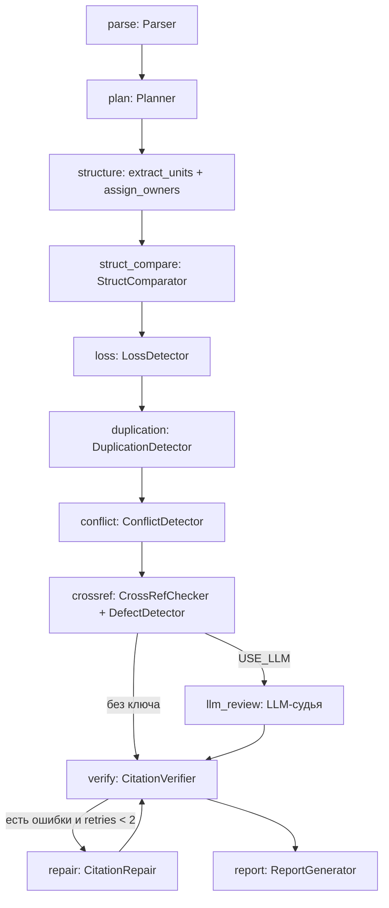

# OrgTrace — полная реализация ИИ-агента для HackAlem AI (Кейс 1)

> Документ для команды: концепция, архитектура, алгоритмы, план на 5 часов с коммитами,
> формат отчёта, промпты для Codex, сценарий демо и **полный исходный код** (приложение A).
> Код проверен на контрольном комплекте (ред. 8 → ред. 9 Положения о внутреннем аудите):
> `pytest` — 14 из 14 тестов, 24 вывода, 0 неподтверждённых.

**Как пользоваться документом.** Если правила хакатона разрешают заготовки — возьмите код из
приложения A (или архив) как есть и тратьте 5 часов на деплой, UI и README. Если заготовки
запрещены — используйте документ как техническое задание: собирайте модули по почасовому плану
(раздел 5) с помощью промптов для Codex (раздел 7), а код из приложения A — как эталон
для сверки.

---

## 1. Elevator pitch

**OrgTrace — агент, который не верит на слово.**

Реорганизация — это сотни пунктов в двух редакциях положений. Эксперт тратит дни, чтобы понять,
какая функция потерялась по дороге. OrgTrace за пару секунд сопоставляет структуры «до» и «после»,
находит потерянные, перенесённые и дублирующиеся функции и конфликты интересов. Ни один вывод
не попадает в отчёт без дословной цитаты, номера пункта и страницы, и эти ссылки проверяет код,
а не модель. Даже сломанные перекрёстные ссылки после перенумерации агент находит сам.

Три отличия от «загрузили PDF в ChatGPT»:

1. **Детерминированное ядро.** Сравнение работает без API-ключа, воспроизводимо и покрыто тестами.
   LLM — надстройка для пограничных случаев, а не единственный источник истины.
2. **Evidence-gating.** `CitationVerifier` сверяет каждую цитату с текстом пункта; при ошибке
   граф уходит в `CitationRepair` и повторяет проверку. Это прямо закрывает ограничение кейса
   «агент не должен формировать неподтверждённые утверждения».
3. **Различие «потеря / перенос / устранённое дублирование».** Функция, которая перешла от ДНМ
   к ДИТААД/ДОА, не считается потерянной. Функция, исключённая у ДККМ, но оставшаяся у ДНМ,
   где она была и раньше, помечается как устранённое дублирование.

---

## 2. Что агент находит на контрольном комплекте

Прогон `python -m app.cli` в детерминированном режиме (без ключа), время ≈ 2 с.

### 2.1. Структура (Must have 1)

| Было (ред. 8) | Стало (ред. 9) | Статус | Источник |
|---|---|---|---|
| Направление внутреннего аудита (НВА) | ДИТААД, ДОА | реорганизовано | ред. 8 п. 3.5.а; ред. 9 п. 3.4.а, 3.4.б, стр. 6 |
| — | ДИТААД (с Центром анализа данных) | создано | ред. 9 п. 3.4.а, стр. 6 |
| — | ДОА | создано | ред. 9 п. 3.4.б, стр. 6 |
| ДНМ | ДНМ | сохранено, состав должностей изменён | ред. 8 п. 3.4.а; ред. 9 п. 3.4.в |
| ДККМ | ДККМ | сохранено, состав должностей сокращён | ред. 8 п. 3.4.б; ред. 9 п. 3.4.г |

В ред. 8 «направление ВА» — не подразделение из п. 3.4, а должность (п. 3.5.а) с собственным
блоком функций (п. 5.3). Агент выделяет его как «функциональную единицу» и видит, что 100%
её функций раздела 5 оказались у ДИТААД и ДОА.

### 2.2. Функции (Must have 2)

| ID | Тип | Пункт ред. 8 | Что произошло |
|---|---|---|---|
| L1 | потеря | 5.6.2 (ДККМ) | «формировать группы контроля качества…» — аналога нет |
| L2 | потеря | 5.6.3 (ДККМ) | «предложения по объему и содержанию внешней оценки БВА» — аналога нет |
| L3 | потеря | 5.7.2 (ДНМ) | «доводить до сведения Руководителей… результаты… консультационных услуг» — аналога нет |
| P2 | частичная | 5.3.4.б (НВА) | утрачено «контроль сроков выполнения графика по проверке проектной командой» |
| P3 | частичная | 5.5.5 (ДККМ) | утрачено «ежеквартальной основе и по итогам года» |
| P4 | частичная | 5.7.1 (ДНМ) | утрачено «утверждению программ предоставления гарантий и консультаций» |
| P1 | частичная (низкая) | 5.3.4.а (НВА) | формулировка сокращена; вероятный ложноположительный вывод низкой критичности |
| M1, M2 | перенос | 5.4.4.а–б (ДНМ) | Карта гарантий и субъекты СВК → ДИТААД/ДОА, ред. 9 п. 5.3.3.а–б |
| R1 | устранено дублирование | 5.5.4 (ДККМ) | анализ непрерывного аудита остался только у ДНМ (п. 5.4.5) |

### 2.3. Дублирование и конфликты интересов (Must have 3)

| ID | Что | Источник (ред. 9) |
|---|---|---|
| D1 | контроль устранения недостатков: ДИТААД/ДОА и ДККМ | п. 5.3.7 и п. 5.5.5 |
| D2 | анализ результатов непрерывного аудита: ДИТААД/ДОА и ДНМ | п. 5.3.8 и п. 5.4.5 |
| K2 | самопроверка: ДНМ консультирует по контролям и ведёт их мониторинг при запрете внедрять процедуры | п. 5.4.4 и п. 5.8.1.б |
| K3 | Главный аудитор может участвовать в органах управления подконтрольных обществ (новое, меры по КИ есть) | п. 4.4 |
| K1 | перекрёстное подчинение «Директор проектов ДККМ» → Директор НВА (в ред. 8; устранено в ред. 9) | ред. 8 п. 3.6.а |

### 2.4. Дефекты документа (бонус для судей)

| ID | Что | Источник |
|---|---|---|
| X1, X2 | ред. 9 пп. 5.10.2 и 5.10.5 ссылаются на «п. 5.8.1 и 5.8.2». После перенумерации это запреты, а права доступа теперь в пп. 5.7.1–5.7.2 | ред. 9 стр. 12 |
| X4 | п. 9.37 упоминает «Директора операционного аудита», которого нет в разделе 3 | ред. 9 стр. 18 |
| X3 | пустой пункт «5.5.3. ;» | ред. 8 стр. 9 |

Важно: «11.10» в тексте ред. 9 — артефакт извлечения текста (номер страницы «1» + «1.10»),
а не опечатка. Постраничный парсер его не допускает.

---

## 3. Архитектура

### 3.1. Граф агента (LangGraph)



Состояние графа (`AgentState`): `docs`, `plan`, `toolkit`, `findings`, `gray` (пограничные
кандидаты для LLM), `dup_cands`, `unverified`, `retries`, `trace` (журнал шагов для UI и README).

Агентные свойства, которые стоит назвать судьям:

- **Планирование.** `Planner` проверяет, есть ли в документах перечень подразделений и раздел
  функций, и включает только применимые инструменты.
- **Инструменты.** Каждый детектор — отдельный инструмент со своим результатом и шагом в журнале.
- **Самокоррекция.** Цикл `verify ⇄ repair` с ограничением попыток.
- **Function Calling.** Чат эксперта (`POST /api/chat`, вкладка «Вопрос агенту»): модель сама
  вызывает `search_clauses`, `get_clause`, `list_findings` и отвечает со ссылками на пункты.
- **Деградация без LLM.** Любая ошибка API не роняет пайплайн: остаются детерминированные выводы.

### 3.2. Модель данных

```
Clause   {clause_id, doc_id, edition, number, text, page, section, parent, depth, owner_units[], is_leaf}
Evidence {doc_id, clause, page, quote, role: source|target|closest|support}
Finding  {id, category, type, severity, title, units_before[], units_after[], evidence[],
          similarity, rationale, recommendation, confidence, method, verified, verify_note}
Report   {meta, summary, structure_changes[], function_findings[], duplications[],
          conflicts_of_interest[], document_defects[], unverified_findings[], agent_trace[],
          executive_summary}
```

### 3.3. Ключевые алгоритмы

**Парсер (`app/parser/clauses.py`).**
- Текст извлекается постранично (PyMuPDF), последняя строка-число (номер страницы) удаляется.
  Поэтому «53.4.» не превращается в пункт 53.4, а у каждого пункта есть точная страница.
- Склеенные пункты делятся регуляркой, которая срабатывает только если перед точкой не цифра:
  «Общества. 3.10.Работники» делится, «5.1.1.» — нет.
- Подпункты «а.», «б.» привязываются к последнему номерному пункту (`5.4.4.б`), в том числе
  когда буква стоит одна на строке (выравнивание по ширине).
- Повторяющиеся буквенные подпункты получают суффикс `#2`; оглавление отсекается.

**Оргструктура (`app/agent/structure.py`).**
- Подразделения — дочерние пункты пункта «…состоит из следующих структурных подразделений»,
  аббревиатура берётся из скобок.
- Должность «Директор X» в перечне подчинённых Главному аудитору без аббревиатуры становится
  функциональной единицей (НВА).
- Владелец функций раздела 5 определяется по заголовку пункта `5.N`: аббревиатура → нечёткое
  совпадение с полным названием → «Директоры департаментов» (все) → «Главный аудитор» (ГА).
  Специальные владельцы: ГА, БВА (все работники), Общество.

**Сходство (`app/agent/similarity.py`, `detectors.lex_score`).**
- TF-IDF по символьным n-граммам 3–5 (устойчиво к падежам) или эмбеддинги OpenAI.
- Лексическая поправка: доля слов (по основам из 6 букв) короткого текста, входящих в длинный
  в том же порядке. Засчитывается только при значении ≥ 0.8, чтобы не завышать случайные совпадения.
- Пороги для TF-IDF: `SIM_KEPT=0.80`, `SIM_LOST=0.50`, `SIM_DUP=0.80`.

**LossDetector — дерево решений для каждого пункта-функции ред. 8:**
1. Владельцы с учётом реорганизации (НВА → ДИТААД, ДОА).
2. Лучшее совпадение у того же владельца ≥ 0.80 → функция сохранена. Если в ней утрачен фрагмент
   ≥ 4 значимых слов, которого нет ни в одном пункте того же владельца → «частичная потеря».
3. Иначе лучшее совпадение у другого владельца ≥ 0.80 → «перенос». Если у нового владельца
   функция была и раньше → «устранено дублирование».
4. Иначе ≥ 0.50 → «частичная потеря» с утраченным фрагментом (или пропуск, если это просто
   переформулировка у того же владельца).
5. Иначе → «потеря». Типовые обязанности руководителя («запрашивает информацию», «выполняет
   прочие поручения» и т. п.) не считаются ни переносом, ни дублированием.

**DuplicationDetector.** Пары листовых функций ред. 9 с непересекающимися владельцами,
без типовых обязанностей, со сходством ≥ 0.80.

**ConflictDetector (правила).**
- R1 — перекрёстное подчинение: в штате подразделения Y есть должность с аббревиатурой X.
- R2 — самопроверка: подразделение оказывает консультационные услуги по контролям и ведёт
  их мониторинг, а положение запрещает БВА внедрять контрольные процедуры.
- R3 — участие в органах управления подконтрольных обществ; проверяется наличие мер по КИ.

**CrossRefChecker.** Ссылка «п. X.Y» в ред. 9 считается битой, если содержание пункта X.Y
изменилось (сходство < 0.5), текст перед ссылкой ближе к прежнему содержанию, чем к новому,
и прежнее содержание нашлось под другим номером.

**CitationVerifier.** Пункт существует → страница совпадает → `partial_ratio(цитата, текст) ≥ 90`.
`CitationRepair` подставляет ближайший дословный фрагмент и правильную страницу.

---

## 4. Структура репозитория

```
orgtrace/
├── app/
│   ├── config.py            # переменные окружения, пороги
│   ├── models.py            # Pydantic: Clause, Document, Evidence, Finding, Report
│   ├── parser/
│   │   ├── clauses.py       # нарезка на пункты
│   │   └── loader.py        # PDF / DOCX / XLSX
│   ├── agent/
│   │   ├── similarity.py    # TF-IDF / OpenAI embeddings
│   │   ├── structure.py     # подразделения, должности, владельцы функций
│   │   ├── detectors.py     # Toolkit: все инструменты-детекторы
│   │   ├── verifier.py      # CitationVerifier + CitationRepair
│   │   ├── llm.py           # LLM-судья, резюме, Function Calling чат
│   │   └── graph.py         # LangGraph-оркестратор
│   ├── report.py            # JSON + Markdown
│   ├── pipeline.py          # общий вход для API и UI, инструменты чата
│   ├── main.py              # FastAPI
│   └── cli.py               # командная строка
├── ui/app.py                # Streamlit
├── tests/                   # conftest, test_parser, test_golden, test_verifier
├── data/samples/            # контрольный комплект (ред. 8, ред. 9)
├── demo_cache/              # эталонный отчёт для демо
├── requirements.txt, .env.example, Makefile, Dockerfile, docker-compose.yml, render.yaml
└── README.md
```

---

## 5. Почасовой план (коммит в конце каждого часа)

До старта: создать пустой репозиторий, подключить Render к GitHub, положить PDF
в `data/samples/`, получить API-ключ.

| Час | Задачи | Файлы | Проверка | Коммит |
|---|---|---|---|---|
| 1 | Модели, парсер PDF/DOCX/XLSX, FastAPI-скелет | `models.py`, `parser/*`, `config.py`, `main.py` (health), `requirements.txt` | `pytest tests/test_parser.py` | `feat: clause-level parser for PDF/DOCX/XLSX + FastAPI skeleton` |
| 2 | Оргструктура, сходство, StructComparator и LossDetector, граф LangGraph | `agent/structure.py`, `agent/similarity.py`, `agent/detectors.py` (часть), `agent/graph.py` | CLI печатает реорганизацию и L1–L3 | `feat: LangGraph orchestrator with StructComparator & LossDetector` |
| 3 | Дублирование, конфликты, ссылки, верификатор и repair-цикл, отчёт, золотые тесты | `detectors.py`, `verifier.py`, `report.py`, `pipeline.py`, `cli.py`, `tests/*` | `pytest -q` → 14 passed | `feat: evidence-gated findings, JSON/MD report, golden tests` |
| 4 | Streamlit, LLM-слой и чат, `demo_cache`, деплой на Render | `ui/app.py`, `agent/llm.py`, `render.yaml`, `Dockerfile` | живой URL открывает демо | `feat: Streamlit UI, LLM review & function-calling chat, Render deploy` |
| 5 | README, финальный прогон на живом URL, запись демо | `README.md` | прогон сценария из раздела 8 | `docs: README, architecture, reproducibility guide` |

Если час сорвался: LLM-слой (час 4) можно выбросить без потерь для Must have. Деплой и README
выбрасывать нельзя.

---

## 6. Формат выходных данных

### 6.1. JSON-схема отчёта

```json
{
  "meta": {
    "run_id": "20260923T082539_cb722a",
    "generated_at": "…Z",
    "mode": "deterministic | llm",
    "llm_model": null,
    "similarity_backend": "tfidf",
    "documents": [
      {"doc_id": "D8", "file": "…protocol13.pdf", "title": "Положение о внутреннем аудите",
       "edition": "8", "approved": "Протокол № 13 от 25 июня 2021", "clauses": 452, "role": "before"},
      {"doc_id": "D9", "file": "…protocol7.pdf", "edition": "9",
       "approved": "Протокол № 7 от 23 декабря 2022", "clauses": 453, "role": "after"}
    ],
    "disclaimer": "Выводы носят рекомендательный характер…"
  },
  "summary": {
    "units": {"created": 2, "kept": 2, "reorganized": 1, "removed": 0},
    "functions": {"lost": 3, "partially_lost": 4, "moved": 2, "removed_duplicate": 1},
    "duplications": 2, "conflicts_of_interest": 3, "document_defects": 4, "unverified": 0
  },
  "structure_changes": [Finding],
  "function_findings": [Finding],
  "duplications": [Finding],
  "conflicts_of_interest": [Finding],
  "document_defects": [Finding],
  "unverified_findings": [Finding],
  "agent_trace": [{"step": "loss", "tool": "LossDetector", "summary": "найдено: 10", "ms": 109}],
  "executive_summary": ""
}
```

### 6.2. Реальные выводы из `demo_cache/report_08_09.json`

```json
[
  {
    "id": "L1",
    "category": "function",
    "type": "lost",
    "severity": "high",
    "title": "Потеря функции: формировать группы контроля качества с привлечением работников БВА в соответствии с ресурс…",
    "units_before": [
      "ДККМ"
    ],
    "units_after": [],
    "evidence": [
      {
        "doc_id": "D8",
        "clause": "5.6.2",
        "page": 10,
        "quote": "формировать группы контроля качества с привлечением работников БВА в соответствии с ресурсным планом и бюджетом затрат БВА;",
        "role": "source"
      },
      {
        "doc_id": "D9",
        "clause": "5.2.7",
        "page": 8,
        "quote": "инициировать привлечение работников Общества и сторонних экспертов для реализации планов и задач БВА.",
        "role": "closest"
      }
    ],
    "similarity": 0.32,
    "rationale": "Для п. 5.6.2 ред. 8 не найдено аналога в ред. 9 (максимальное сходство 0.32).",
    "recommendation": "Решить, нужна ли функция; при необходимости закрепить её за подразделением в новой редакции.",
    "method": "similarity",
    "verified": true,
    "verify_note": "цитаты сверены с текстом пунктов"
  },
  {
    "id": "M1",
    "category": "function",
    "type": "moved",
    "severity": "medium",
    "title": "Перенос функции: использования в своей деятельности результатов работы других субъектов СВК и иных заинтере…",
    "units_before": [
      "ДНМ"
    ],
    "units_after": [
      "ДИТААД",
      "ДОА"
    ],
    "evidence": [
      {
        "doc_id": "D8",
        "clause": "5.4.4.а",
        "page": 9,
        "quote": "использования в своей деятельности результатов работы других субъектов СВК и иных заинтересованных сторон, включая оценку качества и надежности результатов работ субъектов СВК (в т.ч. применяемую методологию, процедуры и",
        "role": "source"
      },
      {
        "doc_id": "D9",
        "clause": "5.3.3.а",
        "page": 8,
        "quote": "использования в своей деятельности результатов работы других субъектов СВК и иных заинтересованных сторон, включая оценку качества и надежности результатов работ субъектов СВК (в т.ч. применяемую методологию, процедуры и",
        "role": "target"
      }
    ],
    "similarity": 1.0,
    "rationale": "Функция перешла от ДНМ к ДИТААД/ДОА (п. 5.3.3.а, сходство 1.00).",
    "recommendation": "Убедиться, что у ДИТААД/ДОА есть ресурсы и полномочия для выполнения функции.",
    "method": "similarity",
    "verified": true,
    "verify_note": "цитаты сверены с текстом пунктов"
  },
  {
    "id": "X1",
    "category": "defect",
    "type": "broken_cross_reference",
    "severity": "high",
    "title": "Некорректная перекрёстная ссылка: ред. 9, п. 5.10.2",
    "units_before": [],
    "units_after": [],
    "evidence": [
      {
        "doc_id": "D9",
        "clause": "5.10.2",
        "page": 12,
        "quote": "п. 5.8.1 и 5.8.2",
        "role": "source"
      },
      {
        "doc_id": "D9",
        "clause": "5.8.1",
        "page": 11,
        "quote": "выполнять функциональные обязанности, не связанные с деятельностью внутреннего аудита, как это определено в настоящем Положении, в том числе:",
        "role": "support"
      },
      {
        "doc_id": "D9",
        "clause": "5.7.1",
        "page": 10,
        "quote": "запрашивать у должностных лиц Общества и получать беспрепятственный и неограниченный доступ в разумные сроки к любым активам (в том числе служебным помещениям), документам, данным, информационным системам, бухгалтерским ",
        "role": "target"
      }
    ],
    "similarity": null,
    "rationale": "После перенумерации ссылка указывает на другое содержание: п. 5.8.1 теперь — «выполнять функциональные обязанности, не связанные с деятельностью вну…» (в ред. 8: «запрашивать у должностных лиц Общества и получать беспрепятственный и …»). Прежнее содержание — в п. 5.7.1.",
    "recommendation": "Заменить ссылку на п. 5.8.1 ссылкой на п. 5.7.1.",
    "method": "rule",
    "verified": true,
    "verify_note": "цитаты сверены с текстом пунктов"
  }
]
```

### 6.3. Структура Markdown-отчёта для эксперта

1. Резюме — таблица показателей (+ резюме от LLM, если включён).
2. Изменения оргструктуры — таблица «Было | Стало | Статус | Источник» и пояснения.
3. Потери функций — для каждой: цитата «Было», ближайший аналог, обоснование, рекомендация.
4. Перенесённые функции и устранённое дублирование.
5. Дублирование функций.
6. Конфликты интересов.
7. Дефекты документа.
8. Рекомендации (только высокая и средняя критичность, со ссылками).
9. Методология — шаги агента и дисклеймер.

Полный пример лежит в `demo_cache/report_08_09.md` (в архиве).

---

## 7. Промпты для Codex

Используйте их по часам. Каждый промпт самодостаточен и ссылается на уже созданные модули.

### Промпт 1 (час 1): модели и парсер

```
Create a Python 3.11 project "orgtrace". Files: app/config.py, app/models.py,
app/parser/clauses.py, app/parser/loader.py, app/main.py, requirements.txt, tests/test_parser.py.

models.py (Pydantic v2): Clause{clause_id, doc_id, edition, number, text, page:int, section,
parent:str|None, depth:int, owner_units:list[str], is_leaf:bool};
Document{doc_id, file, title, edition, approved, kind, clauses; get(number); subtree(number)};
Evidence{doc_id, clause, page, quote, role}; Finding{id, category, type, severity, title,
units_before, units_after, evidence, similarity, rationale, recommendation, confidence, method,
verified, verify_note}; Report{meta, summary, structure_changes, function_findings, duplications,
conflicts_of_interest, document_defects, unverified_findings, agent_trace, executive_summary}.

clauses.py: split_into_clauses(pages:[(page_no,text)], doc_id, edition) -> (clauses, anomalies).
- Drop the last line of each page if it is only digits (page number).
- Stop at a line "Оглавление".
- Before matching, split a line on inline clause numbers ONLY when the dot before them is not
  preceded by a digit: regex (?<=[^\d.][.;:»)])\s+(?=\d{1,2}(?:\.\d{1,2}){1,3}\.\s?[А-ЯЁа-яё]).
  Also split inline section headers (?<=[^\d.][.;:])\s+(?=\d{1,2}\.\s?[А-ЯЁ][а-яё]) and inline
  letter items (?<=[:;])\s+(?=[а-яё]\.\s).
- Numbered clause: ^(\d{1,2}(?:\.\d{1,2}){0,3})\.\s*(.*)$ (single number only if followed by a capital
  letter = section header). Letter item ^([а-яё])\.(?:\s+(.*))?$ becomes child "<last numbered>.<letter>".
- Other lines are appended to the current clause. Deduplicate numbers with suffix "#2".
- Collapse whitespace, compute is_leaf.
loader.py: load_pdf with PyMuPDF (per page), load_docx restoring list numbering from w:numPr,
load_xlsx (each row -> clause "Sheet!A{row}"), load_any by extension; parse edition
"(редакция No9)" and "Протокол No 7 от «23» декабря 2022" from the first page.
main.py: FastAPI with GET /health.
tests/test_parser.py on data/samples/*.pdf: edition 8/9, clause "5.6.2" of ed.8 is on page 10 and
contains "группы контроля качества"; "3.10" starts with "Работники могут"; "5.4.4.б" exists.
```

### Промпт 2 (час 2): структура, сходство, граф

```
Add app/agent/structure.py, app/agent/similarity.py, app/agent/detectors.py (class Toolkit),
app/agent/graph.py.

structure.py:
- extract_units(doc): children of the clause containing "состоит из следующих структурных
  подразделений" -> departments (name + abbreviation in parentheses). In the clause
  "Главному аудитору подчиняются", a child "Директор X" without a known abbreviation becomes a
  functional unit (name "Направление ...", abbr = initials). Clauses "Директору X подчиняются"
  give positions of unit X.
- resolve_owner(header): "Главный аудитор и работники БВА"/"Работники БВА" -> ["БВА"];
  "Общество обеспечивает" -> ["Общество"]; abbreviations in text; fuzzy match (rapidfuzz
  partial_ratio>=90) of the unit name without "Департамент"; "Директоры департаментов" -> all
  departments; "Главный аудитор" -> ["ГА"].
- assign_owners(doc, units): every clause under header 5.N gets owner_units of that header.
- function_clauses(doc): leaf clauses of section 5, depth>=3, with owners.
similarity.py: class Similarity with backend tfidf (char_wb 3-5, sublinear) or openai embeddings
with disk cache; matrix(a, b) -> cosine matrix.
detectors.py Toolkit(before, after, units_before, units_after):
- combined matrix = tfidf cosine, raised to lex_score if lex_score>=0.8 (lex_score = share of
  6-char stems of the shorter text found in order in the longer, x0.95, needs >=5 words).
- struct_comparator(): kept (same abbr), created, and for disappeared units: count where their
  section-5 functions matched (>=SIM_LOST); receivers with >=30% share -> "reorganized".
- loss_detector(): the decision tree kept / partially_lost (lost fragment via difflib) / moved /
  removed_duplicate / lost, ignoring generic manager duties (list of regex).
graph.py: LangGraph StateGraph parse -> plan -> structure -> struct_compare -> loss -> ... -> report,
each node appends {"step","tool","summary","ms"} to state["trace"] and calls on_step callback.
```

### Промпт 3 (час 3): остальные детекторы, верификатор, отчёт, тесты

```
Extend Toolkit with duplication_detector (pairs of after-edition function clauses with disjoint
owners, not generic, similarity>=SIM_DUP), conflict_detector (rules: cross-subordination by
abbreviation inside a position name; self_review when one unit's clause has "консультационных
услуг" and "мониторинг" while a clause forbids "внедрять операционные и контрольные процедуры";
governance_role for "участвовать в органах управления подконтрольных" with mitigation check),
crossref_checker (refs "п. X.Y" whose target meaning changed after renumbering; context = 250 chars
before the ref must be closer to the old meaning; suggest the new number) and defect_detector
(empty clauses, unknown role "Директор операционного аудита").
Add app/agent/verifier.py: verify(findings, docs) checks clause exists, page matches,
rapidfuzz partial_ratio(normalized quote, normalized text)>=90; repair() replaces the quote with
partial_ratio_alignment substring and fixes the page. In graph: verify -> repair -> verify loop,
max 2 retries, remaining go to unverified_findings.
Add app/report.py (build_report -> Report, to_markdown with sections: summary table, structure
table, losses, moves, duplications, conflicts, defects, recommendations, methodology),
app/pipeline.py (analyze(), RUNS store, chat tool implementations), app/cli.py.
Add tests/test_golden.py asserting: reorganized НВА -> {ДИТААД, ДОА}; lost {5.6.2, 5.6.3, 5.7.2};
partially lost {5.3.4.б, 5.5.5, 5.7.1}; moved {5.4.4.а, 5.4.4.б}; duplication pairs
{5.3.8, 5.4.5} and {5.3.7, 5.5.5}; conflicts of all three types; broken ref in 5.10.2;
zero unverified findings. Add tests/test_verifier.py for a fake quote.
```

### Промпт 4 (час 4): UI, LLM, деплой

```
Create ui/app.py (Streamlit, runs the pipeline in-process): sidebar with two uploaders,
"Запустить агента", "Демо: Положение о ВА, ред. 8 → ред. 9", checkbox to load
demo_cache/report_08_09.json; st.status with live agent steps via on_step; six st.metric;
tabs Структура | Потери функций | Переносы | Дублирование | Конфликты интересов | Дефекты |
Ход агента | Отчёт | Вопрос агенту. Each finding is an expander with side-by-side evidence
columns (Было / Стало / Ближайший аналог), rationale, recommendation, verification status.
Download buttons for Markdown and JSON.
Create app/agent/llm.py: OpenAI client only if OPENAI_API_KEY; review_gray and review_dups with
response_format json_object and temperature 0; executive_summary; chat() with tools
search_clauses/get_clause/list_findings and a max 5-step tool loop. Every LLM error must fall
back to deterministic results. Add node llm_review to the graph (only if planned).
Add Dockerfile (streamlit on $PORT), docker-compose.yml (ui + api), render.yaml (two web services).
```

### Промпт 5 (час 5): README для жюри

```
Проанализируй текущий проект и создай для него полноценный README.md на русском языке.
README должен быть понятен жюри хакатона и содержать:
1. Название проекта
2. Краткое описание — какую проблему решает проект и для кого.
3. Что реализовано — основные функции и возможности решения.
4. Как работает решение — кратко опиши основной пользовательский сценарий от входных данных до результата.
5. Технологии — языки, фреймворки, библиотеки, AI-модели, API и внешние сервисы.
6. Архитектура проекта — основные компоненты и как они взаимодействуют.
7. Установка и запуск — пошаговая инструкция с необходимыми командами.
8. Как проверить решение — пример сценария, который может повторить жюри.
9. Данные и интеграции — какие источники данных, API или внешние сервисы используются.
10. Ограничения — что не реализовано или какие ограничения есть у текущей версии.
11. Ссылка на deployed-версию, если она существует.
Используй только информацию, которую можно подтвердить по текущему репозиторию. Не придумывай
функции, технологии или результаты, которых в проекте нет. Оформи README аккуратно в Markdown.
Дополнительно: добавь таблицу «Требование кейса (Must have 1–5) → файл/функция → пример вывода»
и результаты `pytest -q`, если их можно получить запуском.
```

Готовый README, собранный по этому промпту, уже лежит в корне репозитория.

---

## 8. Сценарий демо (2 минуты)

| Время | Экран | Текст |
|---|---|---|
| 0:00–0:15 | Главная | «Две редакции положения о внутреннем аудите, 25 страниц каждая. Что потерялось при реорганизации? Вручную это день работы». |
| 0:15–0:35 | «Демо» → статус агента | «Агент сам планирует шаги и вызывает инструменты: парсер, сравнение структуры, детекторы. Последний шаг — программная проверка каждой цитаты». |
| 0:35–0:55 | Вкладка «Структура» | «Направление внутреннего аудита реорганизовано в два новых департамента — ДИТААД и ДОА. ДНМ и ДККМ сохранены, но у ДККМ сократился штат». |
| 0:55–1:20 | «Потери функций» → L1, P2 | «У ДККМ пропало право формировать группы контроля качества — п. 5.6.2 ред. 8, страница 10. А тут частичная потеря: из обязанностей исчез контроль сроков по графику проверки». |
| 1:20–1:30 | «Переносы» → M1 | «Карта гарантий не потеряна — она перешла от ДНМ к ДИТААД и ДОА. Агент отличает перенос от потери». |
| 1:30–1:45 | «Дублирование», «Конфликты» | «Анализ непрерывного аудита теперь есть и у ДИТААД/ДОА, и у ДНМ. ДНМ консультирует по контролям и сам их мониторит — риск самопроверки». |
| 1:45–1:55 | «Дефекты» → X1 | «И то, что пропустили авторы: п. 5.10.2 ссылается на 5.8.1, но после перенумерации это уже запреты, а не права доступа». |
| 1:55–2:00 | «Отчёт» → скачать | «Ноль непроверенных выводов. Выводы рекомендательные — финальное слово за экспертом». |

Подготовка: прогоните демо вживую один раз перед защитой (прогрев), держите включённой галочку
кэша как запасной вариант. Если есть ключ, покажите одну реплику во вкладке «Вопрос агенту».

---

## 9. Деплой

**Render (рекомендуется).** New → Blueprint → выбрать репозиторий: `render.yaml` создаст
`orgtrace-ui` (Streamlit) и `orgtrace-api` (FastAPI). В Environment задайте `OPENAI_API_KEY`
(необязательно). Бесплатные сервисы засыпают: откройте URL за 5 минут до защиты.

**Streamlit Community Cloud (запасной вариант для UI).** New app → репозиторий → `ui/app.py`;
секреты в Settings → Secrets.

Vercel не подходит для Streamlit и тяжёлых Python-зависимостей (PyMuPDF, scikit-learn).

---

## 10. Риски и страховки

| Риск | Страховка |
|---|---|
| Упал OpenAI API или нет ключа | Детерминированный режим, LLM-ошибки перехватываются |
| Сервис на Render спит или падает | `demo_cache/report_08_09.json` + галочка кэша, запасной деплой на Streamlit Cloud |
| Контрольный комплект жюри отличается | Планировщик пропускает неприменимые инструменты; пороги в `.env` |
| DOCX с автонумерацией | Восстановление номеров из `w:numPr` в `loader.py` |
| Ложноположительные выводы | Уровни критичности, фильтр типовых обязанностей, дисклеймер |

---

## 11. Развитие (для критерия «Потенциал»)

- Граф знаний «подразделение → должность → функция → пункт» и RACI-матрица.
- Сопоставление функций с законодательством и стандартами IIA (опциональное требование кейса).
- Бенчмаркинг структуры с открытыми данными других операторов.
- Мультиагентная проверка спорных выводов («аудитор-скептик» против «юриста»).
- Сравнение более двух редакций и история изменений функции по версиям.
- OCR для схем оргструктуры в виде изображений.

---

## Приложение A. Полный исходный код

Файлы приведены в порядке сборки. Эталонный отчёт `demo_cache/*` и PDF из `data/samples/`
в документ не включены — они есть в архиве.

### `app/config.py`

```python
"""Настройки OrgTrace. Все значения читаются из переменных окружения (.env)."""
import os

try:  # .env необязателен
    from dotenv import load_dotenv
    load_dotenv()
except ImportError:  # pragma: no cover
    pass

OPENAI_API_KEY = os.getenv("OPENAI_API_KEY", "")
LLM_MODEL = os.getenv("LLM_MODEL", "gpt-4o")
EMBEDDING_MODEL = os.getenv("EMBEDDING_MODEL", "text-embedding-3-small")

# tfidf — офлайн, без API-ключа (воспроизводимо); openai — эмбеддинги OpenAI
SIMILARITY_BACKEND = os.getenv("SIMILARITY_BACKEND", "tfidf")
# LLM используется только если есть ключ и USE_LLM=1
USE_LLM = os.getenv("USE_LLM", "1") == "1" and bool(OPENAI_API_KEY)
USE_CACHE = os.getenv("USE_CACHE", "0") == "1"

# Пороги сходства (откалиброваны для tfidf на контрольном комплекте)
if SIMILARITY_BACKEND == "openai":
    SIM_KEPT, SIM_LOST, SIM_DUP = 0.88, 0.70, 0.90
else:
    SIM_KEPT, SIM_LOST, SIM_DUP = 0.80, 0.50, 0.80

QUOTE_MIN_SCORE = 90          # порог rapidfuzz для верификатора цитат
MAX_VERIFY_RETRIES = 2
CACHE_DIR = os.getenv("CACHE_DIR", ".cache")
DEMO_CACHE_FILE = os.getenv("DEMO_CACHE_FILE", "demo_cache/report_08_09.json")
```

### `app/models.py`

```python
"""Pydantic-модели: пункт документа, доказательство, вывод, отчёт."""
from __future__ import annotations

from typing import Literal, Optional
from pydantic import BaseModel, Field


class Clause(BaseModel):
    clause_id: str                 # "D8:5.6.2"
    doc_id: str                    # "D8"
    edition: str                   # "8"
    number: str                    # "5.6.2", "3.4.а", "14"
    text: str
    page: int
    section: str = ""              # "5. Права и обязанности"
    parent: Optional[str] = None   # номер родителя
    depth: int = 1
    owner_units: list[str] = Field(default_factory=list)
    is_leaf: bool = True


class Document(BaseModel):
    doc_id: str
    file: str
    title: str = ""
    edition: str = ""
    approved: str = ""
    kind: Literal["pdf", "docx", "xlsx"] = "pdf"
    clauses: list[Clause] = Field(default_factory=list)

    def get(self, number: str) -> Optional[Clause]:
        for c in self.clauses:
            if c.number == number:
                return c
        return None

    def subtree(self, number: str) -> list[Clause]:
        return [c for c in self.clauses if c.number == number or c.number.startswith(number + ".")]


class Evidence(BaseModel):
    doc_id: str
    clause: str
    page: int
    quote: str
    role: str = "source"           # source | target | closest | support


class Finding(BaseModel):
    id: str
    category: Literal["structure", "function", "duplication", "conflict", "defect"]
    type: str                      # created|kept|reorganized|removed|lost|partially_lost|moved|...
    severity: Literal["high", "medium", "low", "info"] = "medium"
    title: str
    units_before: list[str] = Field(default_factory=list)
    units_after: list[str] = Field(default_factory=list)
    evidence: list[Evidence] = Field(default_factory=list)
    similarity: Optional[float] = None
    rationale: str = ""
    recommendation: str = ""
    confidence: float = 0.7
    method: Literal["rule", "similarity", "llm", "similarity+llm"] = "rule"
    verified: bool = False
    verify_note: str = ""


class Report(BaseModel):
    meta: dict
    summary: dict
    structure_changes: list[Finding]
    function_findings: list[Finding]
    duplications: list[Finding]
    conflicts_of_interest: list[Finding]
    document_defects: list[Finding]
    unverified_findings: list[Finding]
    agent_trace: list[dict] = Field(default_factory=list)
    executive_summary: str = ""
```

### `app/parser/clauses.py`

```python
"""Нарезка текста нормативного документа на пункты с сохранением страницы.

Учитывает особенности PDF-выгрузок положений:
* номер страницы — отдельная последняя строка страницы (удаляется);
* пункты бывают склеены в одну строку: «...Общества. 3.10.Работники могут...»;
* разделы тоже склеиваются: «...мероприятий. 10.Контроль качества»;
* выровненный по ширине текст даёт по слову на строку;
* подпункты «а.», «б.» ... привязываются к последнему номерному пункту;
* оглавление в конце документа игнорируется.
"""
from __future__ import annotations

import re
from typing import Iterable

from app.models import Clause

NUM_RE = re.compile(r"^(\d{1,2}(?:\.\d{1,2}){0,3})\.\s*(.*)$")
LETTER_RE = re.compile(r"^([а-яё])\.(?:\s+(.*))?$")
# Вставной номер пункта внутри строки (после точки/точки с запятой/двоеточия)
INLINE_CLAUSE_RE = re.compile(
    r"(?<=[^\d.][.;:»)])\s+(?=\d{1,2}(?:\.\d{1,2}){1,3}\.\s?[А-ЯЁа-яё])"
)
# Вставной заголовок раздела: «... мероприятий. 10.Контроль качества»
INLINE_LETTER_RE = re.compile(r"(?<=[:;])\s+(?=[а-яё]\.\s)")
INLINE_SECTION_RE = re.compile(r"(?<=[^\d.][.;:])\s+(?=\d{1,2}\.\s?[А-ЯЁ][а-яё])")
TOC_MARKERS = ("оглавление",)


def _split_inline(line: str) -> list[str]:
    parts = INLINE_CLAUSE_RE.split(line)
    out: list[str] = []
    for p in parts:
        for q in INLINE_SECTION_RE.split(p):
            out.extend(INLINE_LETTER_RE.split(q))
    return [p.strip() for p in out if p and p.strip()]


def _parent_of(number: str) -> str | None:
    if "." not in number:
        return None
    return number.rsplit(".", 1)[0]


def split_into_clauses(
    pages: Iterable[tuple[int, str]], doc_id: str, edition: str
) -> tuple[list[Clause], list[dict]]:
    """pages: [(page_no, text)]. Возвращает (пункты, аномалии нумерации)."""
    clauses: list[Clause] = []
    anomalies: list[dict] = []
    seen: dict[str, int] = {}
    current: Clause | None = None
    last_numbered: Clause | None = None
    section_title = ""
    section_top = 0

    def uniq(number: str) -> str:
        if number in seen:
            seen[number] += 1
            return f"{number}#{seen[number]}"
        seen[number] = 1
        return number

    for page_no, text in pages:
        lines = [l.strip() for l in text.splitlines()]
        while lines and not lines[-1]:
            lines.pop()
        if lines and lines[-1].isdigit():          # номер страницы
            lines.pop()
        stop = False
        for raw in lines:
            if not raw:
                continue
            if raw.lower().strip() in TOC_MARKERS:
                stop = True
                break
            for line in _split_inline(raw):
                m = NUM_RE.match(line)
                if m and int(m.group(1).split(".")[0]) <= 20 and (
                    "." in m.group(1) or re.match(r"^[А-ЯЁ]", m.group(2) or "")
                ):
                    number, body = m.group(1), m.group(2)
                    top = int(number.split(".")[0])
                    if "." not in number:                       # заголовок раздела
                        section_top = top
                        section_title = f"{top}. {body.split('  ')[0]}".strip()
                    elif section_top and top != section_top and top != section_top + 1:
                        anomalies.append({"number": number, "page": page_no,
                                          "expected_section": section_top, "text": body[:120]})
                    else:
                        section_top = top
                    number = uniq(number)
                    current = Clause(
                        clause_id=f"{doc_id}:{number}", doc_id=doc_id, edition=edition,
                        number=number, text=body, page=page_no, section=section_title,
                        parent=_parent_of(number.split("#")[0]), depth=number.count(".") + 1,
                    )
                    clauses.append(current)
                    last_numbered = current
                    continue
                lm = LETTER_RE.match(line)
                if lm and last_numbered is not None:
                    number = uniq(f"{last_numbered.number.split('#')[0]}.{lm.group(1)}")
                    current = Clause(
                        clause_id=f"{doc_id}:{number}", doc_id=doc_id, edition=edition,
                        number=number, text=lm.group(2) or "", page=page_no, section=section_title,
                        parent=last_numbered.number, depth=last_numbered.depth + 1,
                    )
                    clauses.append(current)
                    continue
                if current is not None:                    # продолжение пункта
                    current.text = (current.text + " " + line).strip()
        if stop:
            break

    for c in clauses:
        c.text = re.sub(r"\s+", " ", c.text).strip()
    parents = {c.parent for c in clauses if c.parent}
    for c in clauses:
        c.is_leaf = c.number not in parents
    return clauses, anomalies
```

### `app/parser/loader.py`

```python
"""Загрузка PDF / DOCX / XLSX в модель Document с пунктами."""
from __future__ import annotations

import re
from pathlib import Path

from app.models import Clause, Document
from app.parser.clauses import split_into_clauses


def _meta_from_text(first_page: str) -> dict:
    t = re.sub(r"\s+", " ", first_page)
    ed = re.search(r"редакция\s*(?:No|№|N)?\s*(\d+)", t, re.I)
    prot = re.search(r"Протокол\s*(?:No|№|N)?\s*(\d+)\s*от\s*«?(\d{1,2})»?\s*(\w+)\s*(\d{4})", t, re.I)
    title = re.search(r"(ПОЛОЖЕНИЕ\s+О\s+[А-ЯЁ\s«»\"]+?)(?:\(|АО|$)", t)
    return {
        "edition": ed.group(1) if ed else "",
        "approved": (f"Протокол № {prot.group(1)} от {prot.group(2)} {prot.group(3)} {prot.group(4)}"
                     if prot else ""),
        "title": title.group(1).strip().capitalize() if title else "",
    }


def load_pdf(path: str, doc_id: str) -> tuple[Document, list[dict]]:
    import pymupdf  # PyMuPDF

    pdf = pymupdf.open(path)
    pages = [(i + 1, pdf[i].get_text()) for i in range(len(pdf))]
    meta = _meta_from_text(pages[0][1] if pages else "")
    clauses, anomalies = split_into_clauses(pages, doc_id, meta["edition"])
    doc = Document(doc_id=doc_id, file=Path(path).name, kind="pdf", clauses=clauses, **meta)
    return doc, anomalies


def _docx_paragraph_texts(path: str) -> list[str]:
    """Возвращает абзацы DOCX, восстанавливая автонумерацию списков (w:numPr)."""
    import docx

    d = docx.Document(path)
    counters: dict[tuple[str, int], int] = {}
    out: list[str] = []
    for p in d.paragraphs:
        text = p.text.strip()
        if not text:
            continue
        numpr = p._p.pPr.numPr if p._p.pPr is not None else None
        if numpr is not None and numpr.numId is not None:
            num_id = str(numpr.numId.val)
            lvl = int(numpr.ilvl.val) if numpr.ilvl is not None else 0
            counters[(num_id, lvl)] = counters.get((num_id, lvl), 0) + 1
            for k in [k for k in counters if k[0] == num_id and k[1] > lvl]:
                del counters[k]
            prefix = ".".join(str(counters.get((num_id, l), 1)) for l in range(lvl + 1))
            if not re.match(r"^\d", text):
                text = f"{prefix}. {text}"
        out.append(text)
    for table in d.tables:                       # таблицы оргструктуры
        for row in table.rows:
            cells = [c.text.strip() for c in row.cells if c.text.strip()]
            if cells:
                out.append(" | ".join(dict.fromkeys(cells)))
    return out


def load_docx(path: str, doc_id: str) -> tuple[Document, list[dict]]:
    paras = _docx_paragraph_texts(path)
    text = "\n".join(paras)
    meta = _meta_from_text(text[:3000])
    # У DOCX нет страниц: условная «страница» = блок из 40 абзацев
    pages = [(i // 40 + 1, "\n".join(paras[i:i + 40])) for i in range(0, len(paras), 40)]
    clauses, anomalies = split_into_clauses(pages, doc_id, meta["edition"])
    doc = Document(doc_id=doc_id, file=Path(path).name, kind="docx", clauses=clauses, **meta)
    return doc, anomalies


def load_xlsx(path: str, doc_id: str, edition: str = "") -> tuple[Document, list[dict]]:
    """Каждая непустая строка листа — отдельный «пункт» с адресом Лист!A{row}."""
    import openpyxl

    wb = openpyxl.load_workbook(path, data_only=True, read_only=True)
    clauses: list[Clause] = []
    for ws in wb.worksheets:
        for r_idx, row in enumerate(ws.iter_rows(values_only=True), start=1):
            vals = [str(v).strip() for v in row if v is not None and str(v).strip()]
            if not vals:
                continue
            number = f"{ws.title}!A{r_idx}"
            clauses.append(Clause(
                clause_id=f"{doc_id}:{number}", doc_id=doc_id, edition=edition,
                number=number, text=" | ".join(vals), page=1, section=ws.title,
            ))
    doc = Document(doc_id=doc_id, file=Path(path).name, kind="xlsx", edition=edition, clauses=clauses)
    return doc, []


def load_any(path: str, doc_id: str) -> tuple[Document, list[dict]]:
    ext = Path(path).suffix.lower()
    if ext == ".pdf":
        return load_pdf(path, doc_id)
    if ext == ".docx":
        return load_docx(path, doc_id)
    if ext in (".xlsx", ".xlsm"):
        return load_xlsx(path, doc_id)
    raise ValueError(f"Неподдерживаемый формат: {ext}")
```

### `app/agent/similarity.py`

```python
"""Семантическое сходство пунктов.

* tfidf  — символьные n-граммы (3–5), работает офлайн и детерминированно;
* openai — эмбеддинги OpenAI с дисковым кэшем.
"""
from __future__ import annotations

import hashlib
import json
import os
import re

import numpy as np

from app import config

_STOP = re.compile(r"\b(в|и|по|на|с|к|о|об|для|за|из|от|до|а|также|том|числе|т\.ч\.)\b", re.I)


def normalize(text: str) -> str:
    t = text.lower().replace("ё", "е")
    t = re.sub(r"[«»\"'()\[\];:,.\-–—/]", " ", t)
    t = _STOP.sub(" ", t)
    return re.sub(r"\s+", " ", t).strip()


class Similarity:
    def __init__(self, backend: str | None = None):
        self.backend = backend or config.SIMILARITY_BACKEND
        self._vectorizer = None

    # ---------- tfidf ----------
    def fit(self, corpus: list[str]) -> "Similarity":
        if self.backend == "tfidf":
            from sklearn.feature_extraction.text import TfidfVectorizer
            self._vectorizer = TfidfVectorizer(analyzer="char_wb", ngram_range=(3, 5),
                                               sublinear_tf=True, min_df=1)
            self._vectorizer.fit([normalize(t) for t in corpus])
        return self

    def embed(self, texts: list[str]) -> np.ndarray:
        if self.backend == "openai":
            return self._openai_embed(texts)
        if self._vectorizer is None:
            self.fit(texts)
        m = self._vectorizer.transform([normalize(t) for t in texts])
        return m.toarray()

    def matrix(self, a: list[str], b: list[str]) -> np.ndarray:
        ea, eb = self.embed(a), self.embed(b)
        na = np.linalg.norm(ea, axis=1, keepdims=True) + 1e-9
        nb = np.linalg.norm(eb, axis=1, keepdims=True) + 1e-9
        return (ea / na) @ (eb / nb).T

    # ---------- openai ----------
    def _openai_embed(self, texts: list[str]) -> np.ndarray:
        from openai import OpenAI

        os.makedirs(config.CACHE_DIR, exist_ok=True)
        path = os.path.join(config.CACHE_DIR, "embeddings.json")
        cache = json.load(open(path, encoding="utf-8")) if os.path.exists(path) else {}
        keys = [hashlib.sha1((config.EMBEDDING_MODEL + t).encode()).hexdigest() for t in texts]
        missing = [(k, t) for k, t in zip(keys, texts) if k not in cache]
        if missing:
            client = OpenAI(api_key=config.OPENAI_API_KEY)
            for i in range(0, len(missing), 100):
                chunk = missing[i:i + 100]
                resp = client.embeddings.create(model=config.EMBEDDING_MODEL,
                                                input=[t[:8000] for _, t in chunk])
                for (k, _), item in zip(chunk, resp.data):
                    cache[k] = item.embedding
            json.dump(cache, open(path, "w", encoding="utf-8"))
        return np.array([cache[k] for k in keys])
```

### `app/agent/structure.py`

```python
"""Извлечение оргструктуры (раздел 3), привязка функций к подразделениям (раздел 5)
и сравнение структур «до» / «после»."""
from __future__ import annotations

import re
from dataclasses import dataclass, field

from rapidfuzz import fuzz

from app.models import Clause, Document, Evidence

UNIT_RE = re.compile(r"(.+?)\s*\(([А-ЯЁA-Z]{2,})\)")
SPECIAL = {"ГА": "Главный аудитор", "БВА": "Все работники БВА", "Общество": "Общество"}


@dataclass
class Unit:
    abbr: str
    name: str
    kind: str                       # department | functional | role
    clause: str                     # пункт, где подразделение определено
    page: int
    quote: str
    positions: list[tuple[str, str]] = field(default_factory=list)  # (номер, должность)


def _abbr(name: str) -> str:
    return "".join(w[0].upper() for w in re.findall(r"[А-ЯЁа-яё]{3,}", name))


def _strip_unit_word(name: str) -> str:
    return re.sub(r"^(департамент|управление|отдел|служба|центр|направлени[ея])\s+", "",
                  name.lower()).strip()


def has_abbr(text: str, abbr: str) -> bool:
    return re.search(rf"(?<![А-ЯЁA-Z]){re.escape(abbr)}(?![А-ЯЁA-Z])", text) is not None


def extract_units(doc: Document) -> dict[str, Unit]:
    units: dict[str, Unit] = {}
    # 1) перечень подразделений: пункт «... состоит из следующих структурных подразделений»
    for c in doc.clauses:
        if re.search(r"состоит из следующих структурных подразделений", c.text, re.I):
            for ch in [x for x in doc.clauses if x.parent == c.number]:
                m = UNIT_RE.search(ch.text)
                if m:
                    units[m.group(2)] = Unit(m.group(2), m.group(1).strip(), "department",
                                             ch.number, ch.page, ch.text.rstrip("."))
            break
    # 2) должности, подчинённые Главному аудитору: «Директор X» без аббревиатуры -> функциональная единица
    for c in doc.clauses:
        if re.search(r"Главному аудитору подчиняются", c.text):
            for ch in [x for x in doc.clauses if x.parent == c.number]:
                m = re.match(r"Директор\s+(.+?)\.?$", ch.text)
                if not m or any(has_abbr(ch.text, a) for a in units):
                    continue
                name = m.group(1).strip()
                name = name[0].upper() + name[1:]
                name = re.sub(r"^Направления", "Направление", name)
                ab = _abbr(name)
                units[ab] = Unit(ab, name, "functional", ch.number, ch.page, ch.text.rstrip("."))
            break
    # 3) штатный состав: «Директору X подчиняются работники ... в составе следующих должностей»
    for c in doc.clauses:
        m = re.match(r"Директору\s+(.+?)\s+подчиняются", c.text)
        if not m:
            continue
        owner = resolve_owner("Директор " + m.group(1), units)
        for ab in owner:
            if ab in units:
                units[ab].positions = [(ch.number, ch.text.rstrip("."))
                                       for ch in doc.clauses if ch.parent == c.number]
    return units


def resolve_owner(header: str, units: dict[str, Unit]) -> list[str]:
    h = header.strip()
    low = h.lower()
    if re.search(r"главный аудитор и работники бва|^работники бва", low):
        return ["БВА"]
    if re.search(r"общество обеспечивает", low):
        return ["Общество"]
    found = [ab for ab in units if has_abbr(h, ab)]
    if found:
        return found
    for ab, u in units.items():
        key = _strip_unit_word(u.name)
        if len(key) > 8 and fuzz.partial_ratio(key, low) >= 90:
            return [ab]
    if re.search(r"директор[ыа]? департаментов", low):
        return [ab for ab, u in units.items() if u.kind == "department"]
    if "главный аудитор" in low:
        return ["ГА"]
    return []


def assign_owners(doc: Document, units: dict[str, Unit], section: str = "5") -> None:
    """Каждому пункту раздела 5 (права и обязанности) назначает подразделение-владельца
    по заголовку вида «5.4. Директор департамента ...:»."""
    sec = doc.get(section)
    default = resolve_owner(sec.text, units) if sec else []
    headers = [c for c in doc.clauses if c.depth == 2 and c.number.startswith(section + ".")]
    for h in headers:
        owner = resolve_owner(h.text[:200], units) or default
        for c in doc.subtree(h.number):
            c.owner_units = owner


def unit_label(abbrs: list[str]) -> str:
    return "/".join(abbrs) if abbrs else "—"


def owner_group(abbrs: list[str]) -> str:
    return "+".join(sorted(abbrs))


def function_clauses(doc: Document, section: str = "5") -> list[Clause]:
    """Листовые пункты раздела 5 с назначенным владельцем (без заголовков)."""
    return [c for c in doc.clauses
            if c.number.startswith(section + ".") and c.depth >= 3 and c.is_leaf
            and c.owner_units and len(c.text) > 15]


def ev(c: Clause, quote: str | None = None, role: str = "source") -> Evidence:
    q = quote if quote is not None else c.text
    return Evidence(doc_id=c.doc_id, clause=c.number, page=c.page, quote=q[:220], role=role)
```

### `app/agent/detectors.py`

```python
"""Инструменты агента: StructComparator, LossDetector, DuplicationDetector,
ConflictDetector, CrossRefChecker, DefectDetector.

Все инструменты детерминированные (правила + сходство). LLM (если включён)
используется поверх них для пограничных случаев — см. app/agent/llm.py.
"""
from __future__ import annotations

import difflib
import re
from collections import Counter

import numpy as np
from rapidfuzz import fuzz

from app import config
from app.agent.similarity import Similarity, normalize
from app.agent.structure import (Unit, ev, function_clauses, has_abbr, owner_group,
                                 unit_label)
from app.models import Clause, Document, Finding

SPECIAL_OWNERS = {"ГА", "БВА", "Общество"}

# Типовые обязанности, которые есть у каждого руководителя: не считаем их дублированием
GENERIC_PATTERNS = [
    r"^осуществля\w* выполнение прочих поручений",
    r"^запрашива\w* у руководителей общества",
    r"^взаимодейству\w* [cс] руководителями общества",
    r"^выно\w* предложения по повышению профессионального",
    r"^участву\w* в разработке",
    r"^готов\w* материалы",
    r"^готов\w* предложения для включения в план",
    r"^организует работу",
    r"^вести переписку",
    r"^присутствовать на заседаниях",
    r"^выносить (главному аудитору )?предложения по поощрению",
    r"^использовать конфиденциальную",
]


def is_generic(text: str) -> bool:
    t = text.lower().strip()
    return any(re.search(p, t) for p in GENERIC_PATTERNS)


def lex_score(a: str, b: str) -> float:
    """Доля слов более короткого текста, которые в том же порядке есть в более длинном."""
    wa, wb = [w[:6] for w in normalize(a).split()], [w[:6] for w in normalize(b).split()]
    short, long_ = (wa, wb) if len(wa) <= len(wb) else (wb, wa)
    if len(short) < 5:
        return 0.0
    sm = difflib.SequenceMatcher(a=short, b=long_, autojunk=False)
    matched = sum(bl.size for bl in sm.get_matching_blocks())
    return matched / len(short) * 0.95


def lost_fragments(before: str, after: str, min_words: int = 3) -> list[str]:
    """Фрагменты текста «до», которых нет в тексте «после» (пословный diff)."""
    wa, wb = before.split(), after.split()
    na = [normalize(w)[:6] for w in wa]
    nb = [normalize(w)[:6] for w in wb]
    sm = difflib.SequenceMatcher(a=na, b=nb, autojunk=False)
    out = []
    for tag, i1, i2, _, _ in sm.get_opcodes():
        if tag in ("delete", "replace"):
            words = list(wa[i1:i2])
            while words and len(words[-1].strip(",;.")) <= 2:
                words.pop()
            while words and len(words[0].strip(",;.")) <= 2:
                words.pop(0)
            content = [w for w in na[i1:i2] if len(w) > 3]
            if len(content) >= min_words:
                out.append(" ".join(words).strip(" ,;."))
    return out


class Toolkit:
    """Общий контекст инструментов: документы, подразделения, матрицы сходства."""

    def __init__(self, before: Document, after: Document,
                 units_before: dict[str, Unit], units_after: dict[str, Unit]):
        self.before, self.after = before, after
        self.ub, self.ua = units_before, units_after
        self.sim = Similarity().fit([c.text for c in before.clauses + after.clauses])
        self.fb = function_clauses(before)
        self.fa = function_clauses(after)
        self.M = self._combined(self.fb, self.fa)
        self.reorg_map: dict[str, list[str]] = {}
        self._n = Counter()

    def _combined(self, A: list[Clause], B: list[Clause]) -> np.ndarray:
        if not A or not B:
            return np.zeros((len(A), len(B)))
        M = self.sim.matrix([c.text for c in A], [c.text for c in B])
        for i, a in enumerate(A):                 # лексическая поправка для лучших кандидатов
            for j in np.argsort(-M[i])[:8]:
                lx = lex_score(a.text, B[j].text)
                if lx >= 0.8:                     # засчитываем только явное вхождение
                    M[i, j] = max(M[i, j], lx)
        return M

    def next_id(self, prefix: str) -> str:
        self._n[prefix] += 1
        return f"{prefix}{self._n[prefix]}"

    # ------------------------------------------------------------ StructComparator
    def struct_comparator(self) -> list[Finding]:
        out: list[Finding] = []
        kept = [a for a in self.ub if a in self.ua]
        created = [a for a in self.ua if a not in self.ub]
        gone = [a for a in self.ub if a not in self.ua]

        for ab in gone:                           # куда ушли функции исчезнувшей единицы
            idx = [i for i, c in enumerate(self.fb) if ab in c.owner_units]
            targets = Counter()
            for i in idx:
                j = int(self.M[i].argmax())
                if self.M[i, j] >= config.SIM_LOST:
                    for o in self.fa[j].owner_units:
                        if o not in SPECIAL_OWNERS:
                            targets[o] += 1
            share = {o: n / max(len(idx), 1) for o, n in targets.items()}
            receivers = [o for o, s in share.items() if s >= 0.3 and o in created] or \
                        [o for o, s in share.items() if s >= 0.3]
            u = self.ub[ab]
            fid = self.next_id("S")
            evid = [ev(self._clause(self.before, u.clause), u.quote)]
            if receivers:
                self.reorg_map[ab] = receivers
                for r in receivers:
                    ua = self.ua[r]
                    evid.append(ev(self._clause(self.after, ua.clause), ua.quote, "target"))
                out.append(Finding(
                    id=fid, category="structure", type="reorganized", severity="high",
                    title=f"{u.name} ({ab}) → {', '.join(receivers)}",
                    units_before=[ab], units_after=receivers, evidence=evid,
                    rationale=(f"В ред. {self.after.edition} единица «{u.name}» отсутствует; "
                               f"{round(100 * sum(targets[r] for r in receivers) / max(len(idx), 1))}% "
                               f"её функций (раздел 5) найдены у {', '.join(receivers)}."),
                    recommendation="Проверить, что все функции упразднённой единицы закреплены за новыми подразделениями.",
                    confidence=0.85, method="similarity"))
            else:
                out.append(Finding(
                    id=fid, category="structure", type="removed", severity="high",
                    title=f"Упразднено: {u.name} ({ab})", units_before=[ab], evidence=evid,
                    rationale="Подразделение отсутствует в новой редакции, преемник функций не найден.",
                    recommendation="Определить преемника функций.", confidence=0.7, method="similarity"))

        for ab in created:
            u = self.ua[ab]
            base = [g for g, rs in self.reorg_map.items() if ab in rs]
            pos = "; ".join(p for _, p in u.positions)
            out.append(Finding(
                id=self.next_id("S"), category="structure", type="created", severity="info",
                title=f"Создано: {u.name} ({ab})" + (f" на базе {', '.join(base)}" if base else ""),
                units_after=[ab], evidence=[ev(self._clause(self.after, u.clause), u.quote, "target")],
                rationale=(f"Подразделение впервые указано в ред. {self.after.edition}."
                           + (f" Должности: {pos}." if pos else "")),
                confidence=0.95, method="rule"))

        for ab in kept:
            ub, ua = self.ub[ab], self.ua[ab]
            pb = {re.sub(r"\s+" + ab + r"$", "", p) for _, p in ub.positions}
            pa = {re.sub(r"\s+" + ab + r"$", "", p) for _, p in ua.positions}
            note = ""
            if pb != pa:
                removed_p = sorted(pb - pa)
                added_p = sorted(pa - pb)
                note = (f" Состав должностей изменён: исключены — {', '.join(removed_p) or 'нет'}; "
                        f"добавлены — {', '.join(added_p) or 'нет'}.")
            out.append(Finding(
                id=self.next_id("S"), category="structure", type="kept", severity="info",
                title=f"Сохранено: {ua.name} ({ab})", units_before=[ab], units_after=[ab],
                evidence=[ev(self._clause(self.before, ub.clause), ub.quote),
                          ev(self._clause(self.after, ua.clause), ua.quote, "target")],
                rationale="Подразделение присутствует в обеих редакциях." + note,
                confidence=0.95, method="rule"))
        return out

    # ------------------------------------------------------------ LossDetector
    def _mapped(self, owners: list[str]) -> set[str]:
        s = set(owners)
        for o in owners:
            s |= set(self.reorg_map.get(o, []))
        return s

    def loss_detector(self) -> tuple[list[Finding], list[dict]]:
        findings: list[Finding] = []
        gray: list[dict] = []                     # кандидаты для LLM-классификации
        for i, c in enumerate(self.fb):
            mapped = self._mapped(c.owner_units)
            same_idx = [j for j, a in enumerate(self.fa) if mapped & set(a.owner_units)]
            s_same, j_same = (max(((self.M[i, j], j) for j in same_idx), default=(0.0, -1)))
            j_any = int(self.M[i].argmax()) if self.fa else -1
            s_any = float(self.M[i, j_any]) if j_any >= 0 else 0.0
            before_lbl = unit_label(c.owner_units)

            if s_same >= config.SIM_KEPT:
                t = self.fa[j_same]
                frags = self._really_lost(lost_fragments(c.text, t.text, min_words=4), mapped)
                if frags and s_same < 0.97 and not is_generic(c.text):
                    findings.append(self._fn("partially_lost", "low", c, t, s_same, frags))
                continue
            if s_any >= config.SIM_KEPT and j_any >= 0:
                t = self.fa[j_any]
                existed = self._existed_before(t)
                if is_generic(c.text):
                    continue                      # типовая обязанность руководителя
                if existed:
                    f = self._fn("removed_duplicate", "info", c, t, s_any)
                    f.rationale = (f"Функция исключена у {before_lbl}, но сохраняется у "
                                   f"{unit_label(t.owner_units)}, где она была и раньше "
                                   f"(п. {existed.number} ред. {self.before.edition}). "
                                   f"Вероятно, устранено дублирование.")
                    findings.append(f)
                else:
                    findings.append(self._fn("moved", "medium", c, t, s_any))
                continue
            best_j = j_same if s_same >= s_any else j_any
            best_s = max(s_same, s_any)
            t = self.fa[best_j] if best_j >= 0 else None
            if best_s >= config.SIM_LOST and t is not None:
                frags = self._really_lost(lost_fragments(c.text, t.text), mapped)
                if (not frags and best_j == j_same) or is_generic(c.text):
                    continue                      # переформулировано / типовая обязанность
                f = self._fn("partially_lost", "medium", c, t, best_s, frags)
            else:
                f = self._fn("lost", "high" if not is_generic(c.text) else "medium", c, t, best_s)
            findings.append(f)
            gray.append({"finding_id": f.id, "before": c.text, "after": t.text if t else "",
                         "before_owner": before_lbl,
                         "after_owner": unit_label(t.owner_units) if t else "—"})
        return findings, gray

    def _really_lost(self, frags: list[str], owners: set[str]) -> list[str]:
        """Оставляет только фрагменты, которых нет ни в одном пункте того же владельца."""
        pool = [normalize(a.text) for a in self.after.clauses if owners & set(a.owner_units)]
        return [f for f in frags
                if not any(fuzz.partial_ratio(normalize(f), p) >= 85 for p in pool)]

    def _existed_before(self, target: Clause) -> Clause | None:
        for c in self.fb:
            if set(c.owner_units) & set(target.owner_units):
                if max(self.sim.matrix([c.text], [target.text])[0, 0],
                       lex_score(c.text, target.text)) >= config.SIM_KEPT:
                    return c
        return None

    def _fn(self, typ: str, sev: str, c: Clause, t: Clause | None, s: float,
            frags: list[str] | None = None) -> Finding:
        titles = {"lost": "Потеря функции", "partially_lost": "Частичная потеря функции",
                  "moved": "Перенос функции", "removed_duplicate": "Исключено дублирование"}
        after_lbl = unit_label(t.owner_units) if t else "—"
        evid = [ev(c)]
        if t is not None:
            evid.append(ev(t, role="closest" if typ in ("lost", "partially_lost") else "target"))
        rationale = {
            "lost": f"Для п. {c.number} ред. {c.edition} не найдено аналога в ред. {self.after.edition} "
                    f"(максимальное сходство {s:.2f}).",
            "partially_lost": f"Ближайший аналог — п. {t.number if t else '—'} ({after_lbl}), "
                              f"сходство {s:.2f}." + (f" Утрачено: «{'»; «'.join(frags)}»." if frags else ""),
            "moved": f"Функция перешла от {unit_label(c.owner_units)} к {after_lbl} "
                     f"(п. {t.number if t else '—'}, сходство {s:.2f}).",
            "removed_duplicate": "",
        }[typ]
        rec = {
            "lost": f"Решить, нужна ли функция; при необходимости закрепить её за подразделением в новой редакции.",
            "partially_lost": "Проверить, не утрачено ли существенное содержание формулировки.",
            "moved": f"Убедиться, что у {after_lbl} есть ресурсы и полномочия для выполнения функции.",
            "removed_duplicate": "Действий не требуется; зафиксировать как положительное изменение.",
        }[typ]
        return Finding(
            id=self.next_id({"lost": "L", "partially_lost": "P", "moved": "M",
                             "removed_duplicate": "R"}[typ]),
            category="function", type=typ, severity=sev,
            title=f"{titles[typ]}: {c.text[:90]}{'…' if len(c.text) > 90 else ''}",
            units_before=c.owner_units, units_after=t.owner_units if t and typ != "lost" else [],
            evidence=evid, similarity=round(float(s), 3), rationale=rationale,
            recommendation=rec, confidence=0.75 if typ != "lost" else 0.8, method="similarity")

    # ------------------------------------------------------------ DuplicationDetector
    def duplication_detector(self) -> tuple[list[Finding], list[dict]]:
        B = [c for c in self.fa if not set(c.owner_units) & SPECIAL_OWNERS
             and len(c.owner_units) < len([u for u in self.ua.values() if u.kind == "department"])
             and not is_generic(c.text)]
        M = self._combined(B, B)
        out, cands = [], []
        for i in range(len(B)):
            for j in range(i + 1, len(B)):
                if set(B[i].owner_units) & set(B[j].owner_units):
                    continue
                s = float(max(M[i, j], M[j, i]))
                if s < config.SIM_DUP:
                    continue
                a, b = B[i], B[j]
                f = Finding(
                    id=self.next_id("D"), category="duplication", type="duplication",
                    severity="medium",
                    title=f"Дублирование: {unit_label(a.owner_units)} (п. {a.number}) и "
                          f"{unit_label(b.owner_units)} (п. {b.number})",
                    units_after=sorted(set(a.owner_units + b.owner_units)),
                    evidence=[ev(a), ev(b, role="support")], similarity=round(s, 3),
                    rationale=f"Схожие функции закреплены за разными подразделениями (сходство {s:.2f}).",
                    recommendation="Закрепить функцию за одним подразделением, для второго описать участие (RACI).",
                    confidence=0.7, method="similarity")
                out.append(f)
                cands.append({"finding_id": f.id, "a": a.text, "b": b.text,
                              "a_owner": unit_label(a.owner_units), "b_owner": unit_label(b.owner_units)})
        return out, cands

    # ------------------------------------------------------------ ConflictDetector
    def conflict_detector(self) -> list[Finding]:
        out: list[Finding] = []
        for doc, units, when in ((self.before, self.ub, "before"), (self.after, self.ua, "after")):
            other_units = self.ua if when == "before" else self.ub
            # R1: перекрёстное подчинение — должность подразделения X подчинена руководителю Y
            for ab, u in units.items():
                for num, pos in u.positions:
                    for x in units:
                        if x != ab and has_abbr(pos, x):
                            c = self._clause(doc, num)
                            status = self._persisted_r1(x, pos, when)
                            out.append(Finding(
                                id=self.next_id("K"), category="conflict", type="cross_subordination",
                                severity="high" if when == "after" else "info",
                                title=f"Перекрёстное подчинение: «{pos}» подчинён {u.name} ({ab})"
                                      + (" — устранено в новой редакции" if when == "before" and not status else ""),
                                units_before=[ab, x] if when == "before" else [],
                                units_after=[ab, x] if when == "after" else [],
                                evidence=[ev(c)],
                                rationale=(f"Работник подразделения {x} функционально подчинён руководителю {ab}. "
                                           f"Если {x} контролирует качество работы {ab}, возникает угроза независимости."),
                                recommendation="Исключить подчинение контролирующих работников контролируемому подразделению.",
                                confidence=0.8, method="rule"))
            # R2: консультирование и контроль (мониторинг) в одном подразделении при запрете внедрения процедур
            prohibition = next((c for c in doc.clauses if re.search(
                r"внедрять операционные и контрольные процедуры", c.text)), None)
            if when == "after" and prohibition:
                for ab in units:
                    own = [c for c in doc.clauses if ab in c.owner_units and len(c.owner_units) == 1]
                    consult = next((c for c in own if re.search(r"консультационных услуг", c.text)), None)
                    monitor = consult and re.search(r"мониторинг", consult.text + units[ab].name, re.I)
                    if consult and monitor:
                        existed = any(re.search(r"консультационных услуг", c.text)
                                      for c in self.before.clauses if ab in c.owner_units)
                        out.append(Finding(
                            id=self.next_id("K"), category="conflict", type="self_review",
                            severity="medium", title=f"Риск самопроверки: {units[ab].name} ({ab}) "
                                                     f"консультирует по контролям и осуществляет их мониторинг",
                            units_after=[ab],
                            evidence=[ev(consult, self._window(consult.text, "консультационных услуг")),
                                      ev(prohibition, "внедрять операционные и контрольные процедуры", "support")],
                            rationale=("Подразделение оказывает консультации по совершенствованию СУР/ВК/КУ и "
                                       "одновременно ведёт непрерывный мониторинг СВК; положение запрещает БВА "
                                       "внедрять контрольные процедуры." +
                                       (" Риск существовал и в предыдущей редакции." if existed else "")),
                            recommendation="Развести консультационную и мониторинговую роли или закрепить раскрытие КИ.",
                            confidence=0.65, method="rule"))
            # R3: участие в органах управления подконтрольных обществ
            for c in doc.clauses:
                if when == "after" and re.search(r"участвовать в органах управления подконтрольных", c.text):
                    mit = bool(re.search(r"конфликт|КИ", c.text))
                    in_before = any(re.search(r"участвовать в органах управления подконтрольных", x.text)
                                    for x in self.before.clauses)
                    out.append(Finding(
                        id=self.next_id("K"), category="conflict", type="governance_role",
                        severity="low" if mit else "high",
                        title="Главный аудитор может участвовать в органах управления подконтрольных обществ"
                              + (" (новое положение)" if not in_before else ""),
                        units_after=["ГА"],
                        evidence=[ev(c, self._window(c.text, "участвовать в органах управления"))],
                        rationale=("Совмещение аудиторской и управленческой роли создаёт потенциальный КИ. "
                                   + ("Документ предусматривает меры: раскрытие и заявление о КИ." if mit else "")),
                        recommendation="Контролировать исполнение мер по раскрытию КИ в отчётах БВА.",
                        confidence=0.8, method="rule"))
        return out

    def _persisted_r1(self, x: str, pos: str, when: str) -> bool:
        if when != "before":
            return True
        for u in self.ua.values():
            for _, p in u.positions:
                if has_abbr(p, x) and u.abbr != x:
                    return True
        return False

    # ------------------------------------------------------------ CrossRefChecker
    REF_RE = re.compile(r"(?:п\.|пункт(?:ом|а|у)?)\s*(\d{1,2}(?:\.\d{1,2}){1,3})(?:\s*и\s*(\d{1,2}(?:\.\d{1,2}){1,3}))?")

    def crossref_checker(self) -> list[Finding]:
        """Ссылка «п. X.Y» сохранилась дословно, но после перенумерации пункт X.Y
        означает другое, а прежнее содержание переехало в другой пункт."""
        out: list[Finding] = []
        for c in self.after.clauses:
            for m in self.REF_RE.finditer(c.text):
                broken: list[tuple[str, Clause, Clause, Clause]] = []
                for ref in [g for g in m.groups() if g]:
                    tgt_a, tgt_b = self.after.get(ref), self.before.get(ref)
                    if tgt_a is None:
                        out.append(self._defect("dangling_reference", "medium", c, m.group(0),
                                                f"Пункт {ref} отсутствует в документе."))
                        continue
                    if tgt_b is None:
                        continue
                    ta, tb = self._subtree_text(self.after, ref), self._subtree_text(self.before, ref)
                    if self.sim.matrix([ta], [tb])[0, 0] >= 0.5:
                        continue                  # содержание пункта не изменилось
                    i = c.text.find(m.group(0))
                    ctx = c.text[max(0, i - 250):i]    # смысл ссылки — в тексте перед ней
                    rel_now, rel_old = self.sim.matrix([ctx], [ta, tb])[0]
                    if rel_old <= rel_now + 0.03:
                        continue                  # ссылка стала точнее или не была осмысленной
                    cand = [x for x in self.after.clauses if x.depth == tgt_a.depth]
                    sims = self.sim.matrix([tb], [self._subtree_text(self.after, x.number) for x in cand])[0]
                    moved_to = cand[int(sims.argmax())]
                    if moved_to.number != ref:
                        broken.append((ref, tgt_a, tgt_b, moved_to))
                if not broken:
                    continue
                refs = ", ".join(b[0] for b in broken)
                new = ", ".join(b[3].number for b in broken)
                parts = [f"п. {r} теперь — «{a.text[:70]}…» (в ред. {self.before.edition}: «{b.text[:70]}…»)"
                         for r, a, b, _ in broken]
                fnd = self._defect("broken_cross_reference", "high", c, m.group(0),
                                   "После перенумерации ссылка указывает на другое содержание: "
                                   + "; ".join(parts) + f". Прежнее содержание — в п. {new}.")
                fnd.recommendation = f"Заменить ссылку на п. {refs} ссылкой на п. {new}."
                for _, a, _, mv in broken:
                    fnd.evidence.append(ev(a, role="support"))
                    fnd.evidence.append(ev(mv, role="target"))
                out.append(fnd)
        return out

    # ------------------------------------------------------------ DefectDetector
    def defect_detector(self) -> list[Finding]:
        out: list[Finding] = []
        for doc in (self.before, self.after):
            for c in doc.clauses:
                if c.is_leaf and len(re.sub(r"[\s;.,]", "", c.text)) == 0:
                    out.append(self._defect("empty_clause", "low", c, "",
                                            f"Пункт {c.number} ред. {doc.edition} не содержит текста."))
        # упоминание должности, которой нет в структуре новой редакции
        for c in self.after.clauses:
            for m in re.finditer(r"Директор(?:у|а)?\s+(операционного аудита|направления внутреннего аудита)", c.text):
                phrase = m.group(1)
                if not any(fuzz.partial_ratio(phrase, u.name.lower()) >= 95 and u.kind == "functional"
                           for u in self.ua.values()):
                    out.append(self._defect(
                        "unknown_role", "medium", c, m.group(0),
                        f"Должность «{m.group(0)}» не определена в разделе 3 ред. {self.after.edition} "
                        f"(там указаны: {', '.join('Директор ' + a for a in self.ua)})."))
        return out

    # ------------------------------------------------------------ helpers
    def _defect(self, typ: str, sev: str, c: Clause, quote: str, rationale: str) -> Finding:
        titles = {"broken_cross_reference": "Некорректная перекрёстная ссылка",
                  "dangling_reference": "Ссылка на несуществующий пункт",
                  "empty_clause": "Пустой пункт", "unknown_role": "Неизвестная должность"}
        return Finding(id=self.next_id("X"), category="defect", type=typ, severity=sev,
                       title=f"{titles[typ]}: ред. {c.edition}, п. {c.number}",
                       evidence=[ev(c, quote or c.text)], rationale=rationale,
                       recommendation="Исправить текст документа.", confidence=0.85, method="rule")

    @staticmethod
    def _clause(doc: Document, number: str) -> Clause:
        c = doc.get(number)
        assert c is not None, number
        return c

    @staticmethod
    def _subtree_text(doc: Document, number: str) -> str:
        return " ".join(c.text for c in doc.subtree(number))

    @staticmethod
    def _window(text: str, needle: str, size: int = 160) -> str:
        i = text.find(needle)
        if i < 0:
            return text[:size]
        start = max(0, i - size // 2)
        return text[start:i + len(needle) + size // 2]
```

### `app/agent/verifier.py`

```python
"""CitationVerifier: программная проверка, что каждая цитата действительно есть
в указанном пункте указанного документа. Это не LLM — это код, поэтому
«галлюцинированная» ссылка не может пройти в отчёт."""
from __future__ import annotations

from rapidfuzz import fuzz

from app import config
from app.agent.similarity import normalize
from app.models import Document, Finding


def _find(docs: dict[str, Document], doc_id: str, number: str):
    d = docs.get(doc_id)
    return d.get(number) if d else None


def verify(findings: list[Finding], docs: dict[str, Document]) -> tuple[list[Finding], list[Finding]]:
    """Возвращает (прошедшие, не прошедшие). Меняет поля verified/verify_note."""
    ok, bad = [], []
    for f in findings:
        problems = []
        if not f.evidence:
            problems.append("нет доказательств")
        for e in f.evidence:
            c = _find(docs, e.doc_id, e.clause)
            if c is None:
                problems.append(f"пункт {e.doc_id}:{e.clause} не найден")
                continue
            if c.page != e.page:
                problems.append(f"страница {e.page} ≠ {c.page} для п. {e.clause}")
                continue
            q = normalize(e.quote)
            if q and fuzz.partial_ratio(q, normalize(c.text)) < config.QUOTE_MIN_SCORE:
                problems.append(f"цитата не найдена в п. {e.clause}")
        f.verified = not problems
        f.verify_note = "; ".join(problems) if problems else "цитаты сверены с текстом пунктов"
        (ok if f.verified else bad).append(f)
    return ok, bad


def repair(findings: list[Finding], docs: dict[str, Document]) -> list[Finding]:
    """Самокоррекция: заменяет неточную цитату на ближайший дословный фрагмент пункта,
    исправляет страницу. Если пункт не существует — вывод остаётся непроверенным."""
    for f in findings:
        for e in f.evidence:
            c = _find(docs, e.doc_id, e.clause)
            if c is None:
                continue
            e.page = c.page
            if not e.quote or fuzz.partial_ratio(normalize(e.quote), normalize(c.text)) < config.QUOTE_MIN_SCORE:
                al = fuzz.partial_ratio_alignment(e.quote.lower(), c.text.lower())
                if al is not None and al.score >= 60:
                    e.quote = c.text[al.dest_start:al.dest_end]
                else:
                    e.quote = c.text[:220]
                f.verify_note = "цитата исправлена верификатором"
    return findings
```

### `app/agent/llm.py`

```python
"""Необязательный LLM-слой (OpenAI). Включается, если задан OPENAI_API_KEY.

1. review_gray  — LLM-судья для пограничных случаев потери функций;
2. review_dups  — LLM-судья для кандидатов в дублирование;
3. executive_summary — резюме для эксперта строго по найденным выводам;
4. chat — вопросы эксперта к документам через Function Calling
   (инструменты search_clauses / get_clause / list_findings).

Без ключа все функции возвращают None, и агент работает в детерминированном режиме.
"""
from __future__ import annotations

import json
from typing import Any

from app import config

SYSTEM = (
    "Ты аналитик организационных структур и внутренних нормативных документов. "
    "Используй ТОЛЬКО предоставленный текст пунктов. Не делай утверждений, которых нет в тексте. "
    "Отвечай строго в формате JSON без пояснений вне JSON."
)


def _client():
    if not config.USE_LLM:
        return None
    from openai import OpenAI
    return OpenAI(api_key=config.OPENAI_API_KEY)


def _json_call(prompt: str) -> dict | None:
    client = _client()
    if client is None:
        return None
    try:
        resp = client.chat.completions.create(
            model=config.LLM_MODEL, temperature=0,
            response_format={"type": "json_object"},
            messages=[{"role": "system", "content": SYSTEM}, {"role": "user", "content": prompt}],
        )
        return json.loads(resp.choices[0].message.content or "{}")
    except Exception as exc:  # сеть, лимиты, невалидный JSON — агент продолжает без LLM
        print(f"[llm] fallback: {exc}")
        return None


def review_gray(items: list[dict]) -> dict[str, dict] | None:
    if not items:
        return {}
    prompt = (
        "Для каждой пары определи, что произошло с функцией при переходе от старой редакции к новой.\n"
        "verdict: lost (функции нет) | partially_lost (часть содержания утрачена) | "
        "moved (передана другому подразделению) | reworded (переформулирована без потери смысла).\n"
        "lost_fragment — дословный фрагмент СТАРОГО текста, который утрачен (или пустая строка).\n"
        'Верни JSON {"items":[{"finding_id":"...","verdict":"...","rationale":"одно предложение",'
        '"lost_fragment":"..."}]}\n\n' + json.dumps(items, ensure_ascii=False)
    )
    data = _json_call(prompt)
    if not data:
        return None
    return {x["finding_id"]: x for x in data.get("items", []) if "finding_id" in x}


def review_dups(items: list[dict]) -> dict[str, dict] | None:
    if not items:
        return {}
    prompt = (
        "Для каждой пары функций разных подразделений реши, является ли это реальным дублированием "
        "(одна и та же работа закреплена за двумя подразделениями), а не типовой обязанностью "
        "руководителя или взаимодополняющими ролями.\n"
        'Верни JSON {"items":[{"finding_id":"...","is_duplication":true,"rationale":"одно предложение"}]}\n\n'
        + json.dumps(items, ensure_ascii=False)
    )
    data = _json_call(prompt)
    if not data:
        return None
    return {x["finding_id"]: x for x in data.get("items", []) if "finding_id" in x}


def executive_summary(report_brief: dict) -> str | None:
    prompt = (
        "Составь резюме для эксперта (5–7 предложений, русский язык) ТОЛЬКО по этим выводам. "
        "Упоминай номера пунктов в формате «п. 5.6.2 ред. 8». "
        'Верни JSON {"summary":"..."}\n\n' + json.dumps(report_brief, ensure_ascii=False)
    )
    data = _json_call(prompt)
    return data.get("summary") if data else None


# ---------------------------------------------------------------- Function Calling chat
TOOLS = [
    {"type": "function", "function": {
        "name": "search_clauses",
        "description": "Поиск пунктов документов по смыслу. Возвращает номер, страницу, владельца и текст.",
        "parameters": {"type": "object", "properties": {
            "query": {"type": "string"},
            "doc_id": {"type": "string", "description": "D_BEFORE, D_AFTER или пусто — оба"},
            "top_k": {"type": "integer", "default": 5}}, "required": ["query"]}}},
    {"type": "function", "function": {
        "name": "get_clause",
        "description": "Получить полный текст пункта по номеру.",
        "parameters": {"type": "object", "properties": {
            "doc_id": {"type": "string"}, "number": {"type": "string"}},
            "required": ["doc_id", "number"]}}},
    {"type": "function", "function": {
        "name": "list_findings",
        "description": "Список выводов агента по категории: structure|function|duplication|conflict|defect.",
        "parameters": {"type": "object", "properties": {"category": {"type": "string"}},
                       "required": ["category"]}}},
]


def chat(question: str, tool_impl: dict[str, Any], history: list[dict] | None = None,
         max_steps: int = 5) -> dict | None:
    """Агентный цикл: модель сама решает, какие инструменты вызвать, и отвечает со ссылками."""
    client = _client()
    if client is None:
        return None
    messages = [{"role": "system", "content":
                 "Ты помощник эксперта по реорганизации. Отвечай по-русски, опираясь только на результаты "
                 "инструментов. Каждое утверждение сопровождай ссылкой вида [D8 п. 5.6.2, стр. 10]. "
                 "Если данных нет — так и скажи."}]
    messages += history or []
    messages.append({"role": "user", "content": question})
    calls_log = []
    for _ in range(max_steps):
        resp = client.chat.completions.create(model=config.LLM_MODEL, temperature=0,
                                              messages=messages, tools=TOOLS)
        msg = resp.choices[0].message
        if not msg.tool_calls:
            return {"answer": msg.content, "tool_calls": calls_log}
        messages.append({"role": "assistant", "content": msg.content or "",
                         "tool_calls": [tc.model_dump() for tc in msg.tool_calls]})
        for tc in msg.tool_calls:
            args = json.loads(tc.function.arguments or "{}")
            result = tool_impl[tc.function.name](**args)
            calls_log.append({"tool": tc.function.name, "args": args})
            messages.append({"role": "tool", "tool_call_id": tc.id,
                             "content": json.dumps(result, ensure_ascii=False)[:12000]})
    return {"answer": "Превышено число шагов агента.", "tool_calls": calls_log}
```

### `app/agent/graph.py`

```python
"""Agent-Orchestrator на LangGraph.

parse → plan → structure → struct_compare → loss → duplication → conflict → crossref
      → [llm_review, если есть ключ] → verify ⇄ repair (до MAX_VERIFY_RETRIES) → report
"""
from __future__ import annotations

import time
from typing import Any, Callable, TypedDict

from langgraph.graph import END, StateGraph

from app import config
from app.agent import llm
from app.agent.detectors import Toolkit
from app.agent.structure import assign_owners, extract_units
from app.agent.verifier import repair, verify
from app.models import Document, Finding
from app.parser.loader import load_any


class AgentState(TypedDict, total=False):
    before_path: str
    after_path: str
    docs: dict[str, Document]
    before_id: str
    after_id: str
    plan: list[str]
    toolkit: Any
    findings: list[Finding]
    gray: list[dict]
    dup_cands: list[dict]
    unverified: list[Finding]
    retries: int
    trace: list[dict]
    anomalies: list[dict]
    executive_summary: str
    on_step: Callable[[dict], None] | None


def _log(state: AgentState, step: str, tool: str, summary: str, t0: float) -> list[dict]:
    rec = {"step": step, "tool": tool, "summary": summary, "ms": int((time.time() - t0) * 1000)}
    if state.get("on_step"):
        state["on_step"](rec)
    return state.get("trace", []) + [rec]


def _rename(doc: Document, new_id: str) -> Document:
    doc.doc_id = new_id
    for c in doc.clauses:
        c.doc_id = new_id
        c.clause_id = f"{new_id}:{c.number}"
    return doc


# ------------------------------------------------------------------ nodes
def node_parse(state: AgentState) -> dict:
    t0 = time.time()
    b, an_b = load_any(state["before_path"], "BEFORE")
    a, an_a = load_any(state["after_path"], "AFTER")
    bid = f"D{b.edition}" if b.edition else "D_BEFORE"
    aid = f"D{a.edition}" if a.edition and a.edition != b.edition else "D_AFTER"
    _rename(b, bid), _rename(a, aid)
    return {"docs": {bid: b, aid: a}, "before_id": bid, "after_id": aid,
            "anomalies": an_b + an_a,
            "trace": _log(state, "parse", "Parser",
                          f"{b.file}: {len(b.clauses)} пунктов (ред. {b.edition or '?'}); "
                          f"{a.file}: {len(a.clauses)} пунктов (ред. {a.edition or '?'})", t0)}


def node_plan(state: AgentState) -> dict:
    """Планировщик: решает, какие инструменты применимы к загруженным документам."""
    t0 = time.time()
    b, a = state["docs"][state["before_id"]], state["docs"][state["after_id"]]
    plan = []
    has_struct = all(any("структурных подразделений" in c.text for c in d.clauses) for d in (b, a))
    has_funcs = all(d.get("5") is not None for d in (b, a))
    if has_struct:
        plan.append("struct_compare")
    if has_funcs:
        plan += ["loss", "duplication"]
    plan += ["conflict", "crossref"]
    if config.USE_LLM:
        plan.append("llm_review")
    return {"plan": plan, "trace": _log(state, "plan", "Planner", " → ".join(plan), t0)}


def node_structure(state: AgentState) -> dict:
    t0 = time.time()
    b, a = state["docs"][state["before_id"]], state["docs"][state["after_id"]]
    ub, ua = extract_units(b), extract_units(a)
    assign_owners(b, ub), assign_owners(a, ua)
    tk = Toolkit(b, a, ub, ua)
    return {"toolkit": tk, "findings": [],
            "trace": _log(state, "structure", "extract_units + assign_owners",
                          f"до: {', '.join(ub)}; после: {', '.join(ua)}", t0)}


def _tool_node(name: str, label: str, fn: Callable[[Toolkit], Any]):
    def node(state: AgentState) -> dict:
        t0 = time.time()
        if name not in state.get("plan", []) and name not in ("conflict", "crossref"):
            return {"trace": _log(state, name, label, "пропущено планировщиком", t0)}
        res = fn(state["toolkit"])
        extra = {}
        if isinstance(res, tuple):
            res, side = res
            extra = {"gray" if name == "loss" else "dup_cands": side}
        found = state.get("findings", []) + res
        return {"findings": found, **extra,
                "trace": _log(state, name, label, f"найдено: {len(res)}", t0)}
    return node


def node_llm_review(state: AgentState) -> dict:
    t0 = time.time()
    findings = state["findings"]
    by_id = {f.id: f for f in findings}
    notes = []
    verdicts = llm.review_gray(state.get("gray", []))
    if verdicts:
        for fid, v in verdicts.items():
            f = by_id.get(fid)
            if not f:
                continue
            if v.get("verdict") == "reworded":
                f.type, f.severity = "reworded", "info"
            elif v.get("verdict") in ("lost", "partially_lost", "moved"):
                f.type = v["verdict"]
            f.rationale += f" LLM: {v.get('rationale', '')}"
            f.method = "similarity+llm"
        notes.append(f"пограничных случаев: {len(verdicts)}")
    dv = llm.review_dups(state.get("dup_cands", []))
    if dv:
        for fid, v in dv.items():
            f = by_id.get(fid)
            if f and v.get("is_duplication") is False:
                f.type, f.severity = "not_duplication", "info"
            if f:
                f.rationale += f" LLM: {v.get('rationale', '')}"
                f.method = "similarity+llm"
        notes.append(f"кандидатов в дублирование: {len(dv)}")
    kept = [f for f in findings if f.type not in ("reworded", "not_duplication")]
    return {"findings": kept,
            "trace": _log(state, "llm_review", config.LLM_MODEL,
                          "; ".join(notes) or "LLM недоступен — оставлены детерминированные выводы", t0)}


def node_verify(state: AgentState) -> dict:
    t0 = time.time()
    ok, bad = verify(state["findings"] + state.get("unverified", []), state["docs"])
    return {"findings": ok, "unverified": bad,
            "trace": _log(state, "verify", "CitationVerifier",
                          f"подтверждено: {len(ok)}, не подтверждено: {len(bad)}", t0)}


def node_repair(state: AgentState) -> dict:
    t0 = time.time()
    fixed = repair(state.get("unverified", []), state["docs"])
    return {"unverified": fixed, "retries": state.get("retries", 0) + 1,
            "trace": _log(state, "repair", "CitationRepair",
                          f"попытка {state.get('retries', 0) + 1}: исправлено {len(fixed)}", t0)}


def route_after_verify(state: AgentState) -> str:
    if state.get("unverified") and state.get("retries", 0) < config.MAX_VERIFY_RETRIES:
        return "repair"
    return "report"


def node_report(state: AgentState) -> dict:
    t0 = time.time()
    brief = [{"id": f.id, "type": f.type, "title": f.title,
              "clauses": [f"{e.doc_id} п. {e.clause}" for e in f.evidence]}
             for f in state["findings"] if f.severity != "info"]
    summary = llm.executive_summary({"findings": brief}) if config.USE_LLM else None
    return {"executive_summary": summary or "",
            "trace": _log(state, "report", "ReportGenerator", "отчёт сформирован", t0)}


# ------------------------------------------------------------------ graph
def build_graph():
    g = StateGraph(AgentState)
    g.add_node("parse", node_parse)
    g.add_node("plan", node_plan)
    g.add_node("structure", node_structure)
    g.add_node("struct_compare", _tool_node("struct_compare", "StructComparator",
                                            lambda tk: tk.struct_comparator()))
    g.add_node("loss", _tool_node("loss", "LossDetector", lambda tk: tk.loss_detector()))
    g.add_node("duplication", _tool_node("duplication", "DuplicationDetector",
                                         lambda tk: tk.duplication_detector()))
    g.add_node("conflict", _tool_node("conflict", "ConflictDetector", lambda tk: tk.conflict_detector()))
    g.add_node("crossref", _tool_node("crossref", "CrossRefChecker",
                                      lambda tk: tk.crossref_checker() + tk.defect_detector()))
    g.add_node("llm_review", node_llm_review)
    g.add_node("verify", node_verify)
    g.add_node("repair", node_repair)
    g.add_node("report", node_report)

    g.set_entry_point("parse")
    for a, b in [("parse", "plan"), ("plan", "structure"), ("structure", "struct_compare"),
                 ("struct_compare", "loss"), ("loss", "duplication"),
                 ("duplication", "conflict"), ("conflict", "crossref")]:
        g.add_edge(a, b)
    g.add_conditional_edges("crossref", lambda s: "llm_review" if "llm_review" in s.get("plan", []) else "verify",
                            {"llm_review": "llm_review", "verify": "verify"})
    g.add_edge("llm_review", "verify")
    g.add_conditional_edges("verify", route_after_verify, {"repair": "repair", "report": "report"})
    g.add_edge("repair", "verify")
    g.add_edge("report", END)
    return g.compile()


def run_agent(before_path: str, after_path: str, on_step=None) -> AgentState:
    graph = build_graph()
    return graph.invoke({"before_path": before_path, "after_path": after_path,
                         "retries": 0, "trace": [], "unverified": [], "on_step": on_step},
                        {"recursion_limit": 40})
```

### `app/report.py`

```python
"""Формирование итогового отчёта: JSON (модель Report) и Markdown для эксперта."""
from __future__ import annotations

import datetime as dt
import uuid

from app import config
from app.models import Finding, Report

SEV_ORDER = {"high": 0, "medium": 1, "low": 2, "info": 3}
SEV_RU = {"high": "🔴 высокая", "medium": "🟠 средняя", "low": "🟡 низкая", "info": "⚪ инфо"}
DISCLAIMER = ("Выводы носят рекомендательный характер и требуют проверки ответственным сотрудником. "
              "Каждый вывод подтверждён цитатой из исходного документа; цитаты сверены программно.")


def build_report(state: dict) -> Report:
    findings: list[Finding] = sorted(state.get("findings", []),
                                     key=lambda f: (SEV_ORDER[f.severity], f.id))
    docs = state["docs"]
    by = lambda cat: [f for f in findings if f.category == cat]
    struct, func = by("structure"), by("function")
    summary = {
        "units": {t: sum(1 for f in struct if f.type == t)
                  for t in ("created", "kept", "reorganized", "removed")},
        "functions": {t: sum(1 for f in func if f.type == t)
                      for t in ("lost", "partially_lost", "moved", "removed_duplicate")},
        "duplications": len(by("duplication")),
        "conflicts_of_interest": len(by("conflict")),
        "document_defects": len(by("defect")),
        "unverified": len(state.get("unverified", [])),
    }
    meta = {
        "run_id": f"{dt.datetime.now(dt.timezone.utc).replace(tzinfo=None):%Y%m%dT%H%M%S}_{uuid.uuid4().hex[:6]}",
        "generated_at": dt.datetime.now(dt.timezone.utc).replace(tzinfo=None).isoformat(timespec="seconds") + "Z",
        "mode": "llm" if config.USE_LLM else "deterministic",
        "llm_model": config.LLM_MODEL if config.USE_LLM else None,
        "similarity_backend": config.SIMILARITY_BACKEND,
        "documents": [{"doc_id": d.doc_id, "file": d.file, "title": d.title, "edition": d.edition,
                       "approved": d.approved, "clauses": len(d.clauses),
                       "role": "before" if d.doc_id == state["before_id"] else "after"}
                      for d in docs.values()],
        "disclaimer": DISCLAIMER,
    }
    return Report(meta=meta, summary=summary, structure_changes=struct, function_findings=func,
                  duplications=by("duplication"), conflicts_of_interest=by("conflict"),
                  document_defects=by("defect"), unverified_findings=state.get("unverified", []),
                  agent_trace=state.get("trace", []),
                  executive_summary=state.get("executive_summary", ""))


def _src(f: Finding) -> str:
    return "; ".join(f"{e.doc_id} п. {e.clause}, стр. {e.page}" for e in f.evidence)


def _quotes(f: Finding) -> str:
    role = {"source": "Было", "target": "Стало", "closest": "Ближайший аналог", "support": "См. также"}
    return "\n".join(f"> **{role.get(e.role, e.role)} ({e.doc_id}, п. {e.clause}, стр. {e.page}):** «{e.quote}»"
                     for e in f.evidence)


def _block(f: Finding) -> str:
    return (f"#### {f.id}. {f.title}\n\n"
            f"Критичность: {SEV_RU[f.severity]} · метод: {f.method} · "
            f"{'✔ проверено' if f.verified else '✖ не подтверждено'}\n\n"
            f"{_quotes(f)}\n\n**Обоснование.** {f.rationale}\n\n"
            + (f"**Рекомендация.** {f.recommendation}\n" if f.recommendation else ""))


def to_markdown(r: Report) -> str:
    d = {x["role"]: x for x in r.meta["documents"]}
    b, a = d.get("before", {}), d.get("after", {})
    s = r.summary
    out = [f"# Заключение OrgTrace: сравнение редакций «{a.get('title', '')}»\n",
           f"**До:** {b.get('file')} (ред. {b.get('edition')}, {b.get('approved')})  \n"
           f"**После:** {a.get('file')} (ред. {a.get('edition')}, {a.get('approved')})  \n"
           f"Режим: {r.meta['mode']}, запуск {r.meta['generated_at']}\n",
           "## 1. Резюме\n",
           f"| Показатель | Значение |\n|---|---|\n"
           f"| Подразделения: создано / сохранено / реорганизовано / упразднено | "
           f"{s['units']['created']} / {s['units']['kept']} / {s['units']['reorganized']} / {s['units']['removed']} |\n"
           f"| Потеряно функций / частично | {s['functions']['lost']} / {s['functions']['partially_lost']} |\n"
           f"| Перенесено функций | {s['functions']['moved']} |\n"
           f"| Дублирование | {s['duplications']} |\n"
           f"| Конфликты интересов | {s['conflicts_of_interest']} |\n"
           f"| Дефекты документа | {s['document_defects']} |\n"
           f"| Непроверенные выводы | {s['unverified']} |\n"]
    if r.executive_summary:
        out.append(r.executive_summary + "\n")

    out.append("## 2. Изменения оргструктуры\n")
    out.append("| Было | Стало | Статус | Источник |\n|---|---|---|---|")
    st = {"created": "создано", "kept": "сохранено", "reorganized": "реорганизовано", "removed": "упразднено"}
    for f in r.structure_changes:
        out.append(f"| {', '.join(f.units_before) or '—'} | {', '.join(f.units_after) or '—'} | "
                   f"{st.get(f.type, f.type)} | {_src(f)} |")
    out.append("")
    for f in r.structure_changes:
        if f.type in ("reorganized", "removed") or "изменён" in f.rationale:
            out.append(f"- **{f.title}.** {f.rationale}")
    out.append("")

    sections = [
        ("3. Потери функций", [f for f in r.function_findings if f.type in ("lost", "partially_lost")]),
        ("4. Перенесённые функции и устранённое дублирование",
         [f for f in r.function_findings if f.type in ("moved", "removed_duplicate")]),
        ("5. Дублирование функций", r.duplications),
        ("6. Конфликты интересов", r.conflicts_of_interest),
        ("7. Дефекты документа", r.document_defects),
    ]
    for title, items in sections:
        out.append(f"## {title}\n")
        out.append("\n".join(_block(f) for f in items) if items else "_Не выявлено._\n")

    out.append("## 8. Рекомендации\n")
    recs = [f for f in r.function_findings + r.duplications + r.conflicts_of_interest + r.document_defects
            if f.severity in ("high", "medium") and f.recommendation]
    for f in recs:
        out.append(f"- [{f.id}] {f.recommendation} ({_src(f)})")
    if r.unverified_findings:
        out.append("\n## Непроверенные выводы\n")
        out += [f"- {f.id}: {f.title} — {f.verify_note}" for f in r.unverified_findings]
    out.append("\n## 9. Методология\n")
    out.append("Шаги агента: " + " → ".join(f"{t['tool']} ({t['summary']})" for t in r.agent_trace) + "\n")
    out.append(f"_{r.meta['disclaimer']}_\n")
    return "\n".join(out)
```

### `app/pipeline.py`

```python
"""Единая точка входа для API и UI: запуск агента, хранение запусков, инструменты чата."""
from __future__ import annotations

import json
import os
from typing import Callable

from app import config
from app.agent.graph import run_agent
from app.models import Report
from app.report import build_report

RUNS: dict[str, dict] = {}          # run_id -> {"report": Report, "state": AgentState}


def analyze(before_path: str, after_path: str,
            on_step: Callable[[dict], None] | None = None) -> Report:
    state = run_agent(before_path, after_path, on_step=on_step)
    report = build_report(state)
    RUNS[report.meta["run_id"]] = {"report": report, "state": state}
    os.makedirs("runs", exist_ok=True)
    with open(f"runs/{report.meta['run_id']}.json", "w", encoding="utf-8") as f:
        f.write(report.model_dump_json(indent=2))
    return report


def load_cached_report() -> Report | None:
    if not os.path.exists(config.DEMO_CACHE_FILE):
        return None
    with open(config.DEMO_CACHE_FILE, encoding="utf-8") as f:
        return Report(**json.load(f))


def chat_tools(run_id: str) -> dict:
    """Реализации инструментов для Function Calling (см. app/agent/llm.py: TOOLS)."""
    run = RUNS[run_id]
    state, report = run["state"], run["report"]
    docs, tk = state["docs"], state["toolkit"]

    def search_clauses(query: str, doc_id: str = "", top_k: int = 5):
        pool = [c for d in docs.values() if not doc_id or d.doc_id == doc_id for c in d.clauses]
        sims = tk.sim.matrix([query], [c.text for c in pool])[0]
        idx = sims.argsort()[::-1][:top_k]
        return [{"doc_id": pool[i].doc_id, "number": pool[i].number, "page": pool[i].page,
                 "owner": pool[i].owner_units, "text": pool[i].text[:600],
                 "score": round(float(sims[i]), 3)} for i in idx]

    def get_clause(doc_id: str, number: str):
        d = docs.get(doc_id)
        c = d.get(number) if d else None
        return c.model_dump() if c else {"error": "пункт не найден"}

    def list_findings(category: str):
        items = {"structure": report.structure_changes, "function": report.function_findings,
                 "duplication": report.duplications, "conflict": report.conflicts_of_interest,
                 "defect": report.document_defects}.get(category, [])
        return [f.model_dump() for f in items]

    return {"search_clauses": search_clauses, "get_clause": get_clause, "list_findings": list_findings}
```

### `app/main.py`

```python
"""FastAPI-бэкенд OrgTrace.

POST /api/analyze        — загрузить документы «до» и «после», получить отчёт JSON
POST /api/analyze/demo   — прогон на контрольном комплекте из data/samples
GET  /api/report/{id}.md — отчёт в Markdown
POST /api/chat           — вопрос эксперта к документам (Function Calling, нужен OPENAI_API_KEY)
GET  /health
"""
from __future__ import annotations

import json
import os
import shutil
import tempfile
from pathlib import Path

from fastapi import FastAPI, File, HTTPException, UploadFile
from fastapi.responses import PlainTextResponse
from pydantic import BaseModel

from app import config
from app.pipeline import analyze, chat_tools, load_cached_report, RUNS
from app.report import to_markdown
from app.agent import llm

app = FastAPI(title="OrgTrace API", version="1.0.0",
              description="ИИ-агент анализа организационной структуры и функционала")

SAMPLES = Path("data/samples")
DEMO_BEFORE = SAMPLES / "polozhenie_red08_protocol13.pdf"
DEMO_AFTER = SAMPLES / "polozhenie_red09_protocol7.pdf"


@app.get("/health")
def health():
    return {"status": "ok", "llm": config.USE_LLM, "similarity": config.SIMILARITY_BACKEND}


def _save(upload: UploadFile, folder: str) -> str:
    suffix = Path(upload.filename or "file.pdf").suffix.lower()
    if suffix not in (".pdf", ".docx", ".xlsx", ".xlsm"):
        raise HTTPException(400, f"Формат {suffix} не поддерживается (PDF, DOCX, XLSX)")
    path = os.path.join(folder, Path(upload.filename).name)
    with open(path, "wb") as f:
        shutil.copyfileobj(upload.file, f)
    return path


@app.post("/api/analyze")
def analyze_endpoint(before: UploadFile = File(...), after: UploadFile = File(...)):
    with tempfile.TemporaryDirectory() as tmp:
        report = analyze(_save(before, tmp), _save(after, tmp))
    return json.loads(report.model_dump_json())


@app.post("/api/analyze/demo")
def analyze_demo():
    if config.USE_CACHE:
        report = load_cached_report()
        if report:
            return json.loads(report.model_dump_json())
    report = analyze(str(DEMO_BEFORE), str(DEMO_AFTER))
    return json.loads(report.model_dump_json())


@app.get("/api/report/{run_id}.md", response_class=PlainTextResponse)
def report_md(run_id: str):
    if run_id not in RUNS:
        raise HTTPException(404, "run_id не найден")
    return to_markdown(RUNS[run_id]["report"])


class ChatIn(BaseModel):
    run_id: str
    question: str


@app.post("/api/chat")
def chat_endpoint(body: ChatIn):
    if body.run_id not in RUNS:
        raise HTTPException(404, "Сначала выполните анализ (run_id не найден)")
    res = llm.chat(body.question, chat_tools(body.run_id))
    if res is None:
        raise HTTPException(503, "Чат требует OPENAI_API_KEY")
    return res
```

### `app/cli.py`

```python
"""CLI: python -m app.cli BEFORE AFTER [--out path_without_ext]"""
import argparse
import json

from app.pipeline import analyze
from app.report import to_markdown


def main():
    p = argparse.ArgumentParser(description="OrgTrace: сравнение документов до/после реорганизации")
    p.add_argument("before")
    p.add_argument("after")
    p.add_argument("--out", default="orgtrace_report")
    a = p.parse_args()
    report = analyze(a.before, a.after, on_step=lambda r: print(f"[{r['tool']}] {r['summary']}"))
    with open(a.out + ".json", "w", encoding="utf-8") as f:
        f.write(report.model_dump_json(indent=2))
    with open(a.out + ".md", "w", encoding="utf-8") as f:
        f.write(to_markdown(report))
    print(json.dumps(report.summary, ensure_ascii=False, indent=2))
    print(f"Сохранено: {a.out}.json, {a.out}.md")


if __name__ == "__main__":
    main()
```

### `ui/app.py`

```python
"""Streamlit-интерфейс OrgTrace. Агент запускается в том же процессе (без отдельного API),
чтобы деплой был одним сервисом."""
from __future__ import annotations

import os
import sys
import tempfile
from pathlib import Path

import streamlit as st

ROOT = Path(__file__).resolve().parents[1]
sys.path.insert(0, str(ROOT))
os.chdir(ROOT)

from app import config  # noqa: E402
from app.agent import llm  # noqa: E402
from app.pipeline import RUNS, analyze, chat_tools, load_cached_report  # noqa: E402
from app.report import SEV_RU, to_markdown  # noqa: E402

st.set_page_config(page_title="OrgTrace", page_icon="🧭", layout="wide")
st.title("🧭 OrgTrace — анализ оргструктуры и функционала")
st.caption("Сравнение документов «до» и «после» реорганизации: потери, переносы и дублирование функций, "
           "конфликты интересов. Каждый вывод — со ссылкой на пункт и страницу, цитаты сверены программно.")

SAMPLES = ROOT / "data" / "samples"

with st.sidebar:
    st.header("Документы")
    before = st.file_uploader("ДО реорганизации (PDF/DOCX/XLSX)", type=["pdf", "docx", "xlsx"])
    after = st.file_uploader("ПОСЛЕ реорганизации (PDF/DOCX/XLSX)", type=["pdf", "docx", "xlsx"])
    run_btn = st.button("▶ Запустить агента", type="primary", disabled=not (before and after))
    st.divider()
    demo_btn = st.button("Демо: Положение о ВА, ред. 8 → ред. 9")
    use_cache = st.checkbox("Использовать сохранённый результат демо", value=config.USE_CACHE)
    st.divider()
    st.write(f"Режим: **{'LLM + правила' if config.USE_LLM else 'детерминированный'}**")
    st.write(f"Сходство: **{config.SIMILARITY_BACKEND}**")


def run(before_path: str, after_path: str):
    with st.status("Агент работает…", expanded=True) as status:
        def on_step(rec: dict):
            status.write(f"**{rec['tool']}** — {rec['summary']} ({rec['ms']} мс)")
        report = analyze(before_path, after_path, on_step=on_step)
        status.update(label="Анализ завершён", state="complete", expanded=False)
    st.session_state["report"] = report


if run_btn and before and after:
    with tempfile.TemporaryDirectory() as tmp:
        paths = []
        for up in (before, after):
            p = os.path.join(tmp, up.name)
            Path(p).write_bytes(up.getvalue())
            paths.append(p)
        run(*paths)

if demo_btn:
    cached = load_cached_report() if use_cache else None
    if cached:
        st.session_state["report"] = cached
        st.info("Показан сохранённый результат демо (demo_cache/report_08_09.json).")
    else:
        run(str(SAMPLES / "polozhenie_red08_protocol13.pdf"), str(SAMPLES / "polozhenie_red09_protocol7.pdf"))

report = st.session_state.get("report")
if not report:
    st.info("Загрузите два документа или нажмите «Демо» в боковой панели.")
    st.stop()

s = report.summary
c = st.columns(6)
c[0].metric("Создано подразделений", s["units"]["created"])
c[1].metric("Реорганизовано", s["units"]["reorganized"])
c[2].metric("Потеряно функций", s["functions"]["lost"], f"+{s['functions']['partially_lost']} частично",
            delta_color="off")
c[3].metric("Дублирование", s["duplications"])
c[4].metric("Конфликты интересов", s["conflicts_of_interest"])
c[5].metric("Дефекты документа", s["document_defects"])
st.caption(f"Непроверенных выводов: {s['unverified']} · run_id: {report.meta['run_id']}")
if report.executive_summary:
    st.success(report.executive_summary)


def show(findings):
    if not findings:
        st.write("_Не выявлено._")
    for f in findings:
        badge = "✔" if f.verified else "✖"
        with st.expander(f"{badge} {f.id} · {SEV_RU[f.severity]} · {f.title}"):
            cols = st.columns(len(f.evidence) or 1)
            for col, e in zip(cols, f.evidence):
                role = {"source": "Было", "target": "Стало", "closest": "Ближайший аналог",
                        "support": "См. также"}.get(e.role, e.role)
                col.markdown(f"**{role}** · `{e.doc_id}` п. **{e.clause}**, стр. {e.page}")
                col.markdown(f"> {e.quote}")
            st.markdown(f"**Обоснование.** {f.rationale}")
            if f.recommendation:
                st.markdown(f"**Рекомендация.** {f.recommendation}")
            st.caption(f"Метод: {f.method} · уверенность {f.confidence:.2f} · {f.verify_note}")


tabs = st.tabs(["Структура", "Потери функций", "Переносы", "Дублирование", "Конфликты интересов",
                "Дефекты", "Ход агента", "Отчёт", "Вопрос агенту"])
with tabs[0]:
    rows = [{"Было": ", ".join(f.units_before) or "—", "Стало": ", ".join(f.units_after) or "—",
             "Статус": f.type, "Источник": "; ".join(f"{e.doc_id} п.{e.clause} стр.{e.page}" for e in f.evidence)}
            for f in report.structure_changes]
    st.dataframe(rows, width="stretch", hide_index=True)
    show(report.structure_changes)
with tabs[1]:
    show([f for f in report.function_findings if f.type in ("lost", "partially_lost")])
with tabs[2]:
    show([f for f in report.function_findings if f.type in ("moved", "removed_duplicate")])
with tabs[3]:
    show(report.duplications)
with tabs[4]:
    show(report.conflicts_of_interest)
with tabs[5]:
    show(report.document_defects)
with tabs[6]:
    st.dataframe(report.agent_trace, width="stretch", hide_index=True)
with tabs[7]:
    md = to_markdown(report)
    st.download_button("Скачать отчёт (Markdown)", md, file_name="orgtrace_report.md")
    st.download_button("Скачать отчёт (JSON)", report.model_dump_json(indent=2), file_name="orgtrace_report.json")
    st.markdown(md)
with tabs[8]:
    if not config.USE_LLM:
        st.warning("Для чата с агентом (Function Calling) задайте OPENAI_API_KEY.")
    elif report.meta["run_id"] not in RUNS:
        st.warning("Чат доступен после живого запуска анализа (не для кэшированного результата).")
    else:
        q = st.text_input("Например: «Какие права ДККМ исчезли в новой редакции?»")
        if q:
            with st.spinner("Агент вызывает инструменты…"):
                res = llm.chat(q, chat_tools(report.meta["run_id"]))
            st.markdown(res["answer"])
            st.caption("Вызовы инструментов: " + ", ".join(f"{t['tool']}({t['args']})" for t in res["tool_calls"]))
```

### `tests/conftest.py`

```python
import os
import sys
from pathlib import Path

import pytest

ROOT = Path(__file__).resolve().parents[1]
sys.path.insert(0, str(ROOT))
os.chdir(ROOT)
os.environ.setdefault("USE_LLM", "0")          # тесты детерминированные, без API-ключа
os.environ.setdefault("SIMILARITY_BACKEND", "tfidf")

BEFORE = "data/samples/polozhenie_red08_protocol13.pdf"
AFTER = "data/samples/polozhenie_red09_protocol7.pdf"


@pytest.fixture(scope="session")
def state():
    from app.agent.graph import run_agent
    return run_agent(BEFORE, AFTER)


@pytest.fixture(scope="session")
def report(state):
    from app.report import build_report
    return build_report(state)
```

### `tests/test_parser.py`

```python
from app.parser.loader import load_pdf
from tests.conftest import AFTER, BEFORE


def test_metadata():
    b, _ = load_pdf(BEFORE, "D8")
    a, _ = load_pdf(AFTER, "D9")
    assert b.edition == "8" and a.edition == "9"
    assert "13" in b.approved and "7" in a.approved


def test_clauses_and_pages():
    b, _ = load_pdf(BEFORE, "D8")
    a, _ = load_pdf(AFTER, "D9")
    assert b.get("5.6.2").page == 10
    assert "группы контроля качества" in b.get("5.6.2").text
    assert a.get("3.4.а").text.startswith("Департамент ИТ-аудита")
    assert a.get("3.4").page == 6


def test_glued_clauses_are_split():
    # «...Общества. 3.10.Работники могут...» — склеенные пункты разделяются
    b, _ = load_pdf(BEFORE, "D8")
    assert b.get("3.10").text.startswith("Работники могут")
    assert b.get("5.4.4.б").text.startswith("выявления рисков")


def test_toc_is_ignored():
    a, _ = load_pdf(AFTER, "D9")
    assert all("ОБЩИЕ ПОЛОЖЕНИЯ 1" not in c.text for c in a.clauses)
```

### `tests/test_golden.py`

```python
"""Золотой набор: изменения ред. 8 → ред. 9, которые агент обязан найти (раздел 11 кейса)."""


def _ids(findings, **kw):
    return [f for f in findings if all(getattr(f, k) == v for k, v in kw.items())]


def test_reorganization(report):
    reorg = _ids(report.structure_changes, type="reorganized")
    assert reorg and set(reorg[0].units_after) == {"ДИТААД", "ДОА"}
    created = {u for f in _ids(report.structure_changes, type="created") for u in f.units_after}
    kept = {u for f in _ids(report.structure_changes, type="kept") for u in f.units_after}
    assert created == {"ДИТААД", "ДОА"} and kept == {"ДНМ", "ДККМ"}


def test_lost_functions(report):
    lost = {f.evidence[0].clause for f in report.function_findings if f.type == "lost"}
    assert {"5.6.2", "5.6.3", "5.7.2"} <= lost


def test_partial_losses(report):
    partial = {f.evidence[0].clause for f in report.function_findings if f.type == "partially_lost"}
    assert {"5.3.4.б", "5.5.5", "5.7.1"} <= partial


def test_moved_not_lost(report):
    moved = {f.evidence[0].clause for f in report.function_findings if f.type == "moved"}
    assert {"5.4.4.а", "5.4.4.б"} <= moved


def test_duplication(report):
    pairs = {frozenset(e.clause for e in f.evidence) for f in report.duplications}
    assert frozenset({"5.3.8", "5.4.5"}) in pairs
    assert frozenset({"5.3.7", "5.5.5"}) in pairs


def test_conflicts(report):
    types = {f.type for f in report.conflicts_of_interest}
    assert {"cross_subordination", "self_review", "governance_role"} <= types


def test_broken_cross_reference(report):
    x = [f for f in report.document_defects if f.type == "broken_cross_reference"]
    assert any(f.evidence[0].clause == "5.10.2" for f in x)


def test_everything_verified(report):
    assert report.unverified_findings == []
    all_f = (report.structure_changes + report.function_findings + report.duplications
             + report.conflicts_of_interest + report.document_defects)
    assert all(f.verified and f.evidence for f in all_f)
```

### `tests/test_verifier.py`

```python
from app.agent.verifier import repair, verify
from app.models import Evidence, Finding


def test_fake_quote_is_rejected_and_repaired(state):
    docs = state["docs"]
    f = Finding(id="T1", category="function", type="lost", title="тест",
                evidence=[Evidence(doc_id="D8", clause="5.6.2", page=3,
                                   quote="полностью выдуманная цитата про бюджетирование ИТ")])
    ok, bad = verify([f], docs)
    assert not ok and bad and "страница" in bad[0].verify_note
    repair(bad, docs)
    ok, bad = verify(bad, docs)
    assert ok and ok[0].evidence[0].page == 10


def test_nonexistent_clause_stays_unverified(state):
    f = Finding(id="T2", category="function", type="lost", title="тест",
                evidence=[Evidence(doc_id="D9", clause="99.9", page=1, quote="нет")])
    repair([f], state["docs"])
    ok, bad = verify([f], state["docs"])
    assert bad and not ok
```

### `requirements.txt`

```text
fastapi>=0.110
uvicorn[standard]>=0.29
python-multipart>=0.0.9
pydantic>=2.6
langgraph>=0.2
openai>=1.40
pymupdf>=1.24
python-docx>=1.1
openpyxl>=3.1
scikit-learn>=1.4
numpy>=1.26
rapidfuzz>=3.6
python-dotenv>=1.0
streamlit>=1.50
pytest>=8.0
```

### `.env.example`

```bash
# Без ключа агент работает в детерминированном режиме (правила + TF-IDF)
OPENAI_API_KEY=
LLM_MODEL=gpt-4o
EMBEDDING_MODEL=text-embedding-3-small
# tfidf (офлайн) | openai (эмбеддинги OpenAI)
SIMILARITY_BACKEND=tfidf
USE_LLM=1
# 1 — демо отдаёт сохранённый demo_cache/report_08_09.json
USE_CACHE=0
```

### `.gitignore`

```bash
__pycache__/
*.pyc
.env
.cache/
runs/
.pytest_cache/
.venv/
```

### `Makefile`

```make
.PHONY: install test api ui demo
install:
	pip install -r requirements.txt
test:
	pytest -q
api:
	uvicorn app.main:app --reload --port 8000
ui:
	streamlit run ui/app.py
demo:
	python -m app.cli data/samples/polozhenie_red08_protocol13.pdf data/samples/polozhenie_red09_protocol7.pdf --out demo_cache/report_08_09
```

### `Dockerfile`

```dockerfile
FROM python:3.11-slim
WORKDIR /app
COPY requirements.txt .
RUN pip install --no-cache-dir -r requirements.txt
COPY . .
ENV PORT=8501
CMD streamlit run ui/app.py --server.port ${PORT} --server.address 0.0.0.0 --server.headless true
```

### `docker-compose.yml`

```yaml
services:
  ui:
    build: .
    env_file: .env
    ports: ["8501:8501"]
  api:
    build: .
    env_file: .env
    command: uvicorn app.main:app --host 0.0.0.0 --port 8000
    ports: ["8000:8000"]
```

### `render.yaml`

```yaml
services:
  - type: web
    name: orgtrace-ui
    runtime: python
    buildCommand: pip install -r requirements.txt
    startCommand: streamlit run ui/app.py --server.port $PORT --server.address 0.0.0.0 --server.headless true
    envVars:
      - key: OPENAI_API_KEY
        sync: false
      - key: USE_CACHE
        value: "0"
  - type: web
    name: orgtrace-api
    runtime: python
    buildCommand: pip install -r requirements.txt
    startCommand: uvicorn app.main:app --host 0.0.0.0 --port $PORT
    healthCheckPath: /health
    envVars:
      - key: OPENAI_API_KEY
        sync: false
```

Пустые `app/__init__.py`, `app/parser/__init__.py`, `app/agent/__init__.py` создайте командой `touch`.
